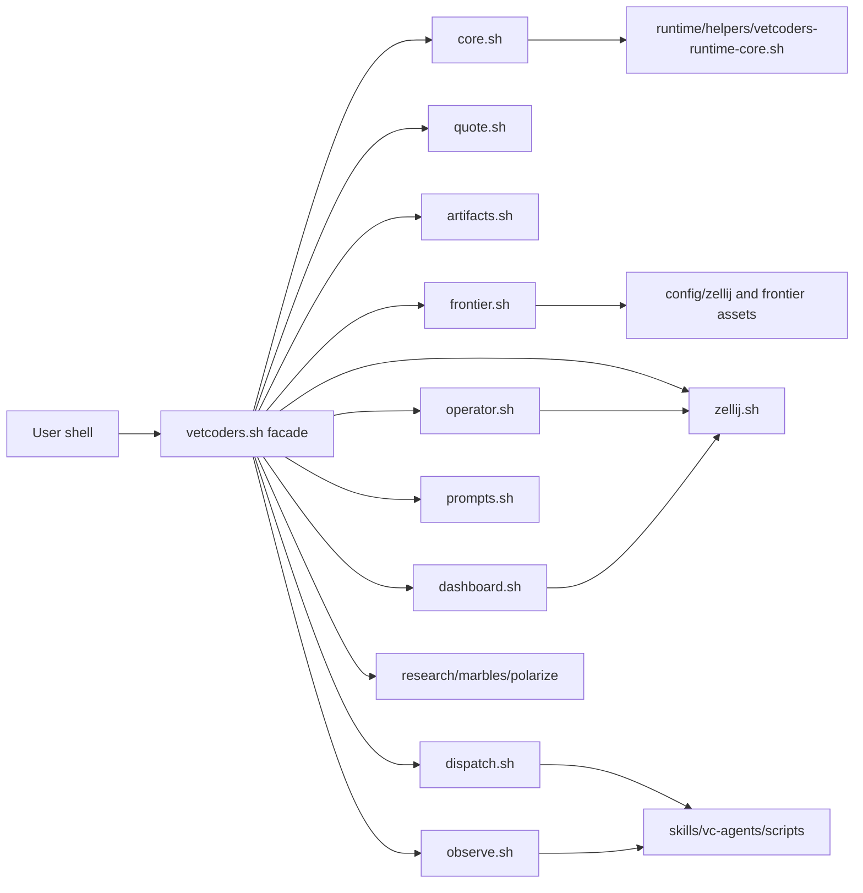

# Requirements

### Overview & Goals

Decompose `skills/vc-agents/shell/vetcoders.sh` from a ~3.3k LOC runtime script into an explicit sourced-module shell runtime while preserving current public behavior.

The final shape keeps `skills/vc-agents/shell/vetcoders.sh` as the compatibility façade for:

1. resolving its own location,
2. sourcing ordered modules under `skills/vc-agents/shell/lib/`,
3. exposing the same public shell functions/wrappers after `source skills/vc-agents/shell/vetcoders.sh`,
4. dispatching the CLI/wrapper surface unchanged.

### Scope

#### In Scope

- Add the requested module set under `skills/vc-agents/shell/lib/`:
  - `core.sh`, `quote.sh`, `artifacts.sh`, `frontier.sh`, `zellij.sh`, `dashboard.sh`, `operator.sh`, `prompts.sh`, `dispatch.sh`, `observe.sh`, `marbles.sh`, `research.sh`, `polarize.sh`, `atuin.sh`.
- Move existing functions out of `vetcoders.sh` without renaming public/internal function names unless necessary to preserve compatibility.
- Preserve all public wrappers currently provided by `vetcoders.sh`, including agent commands, `vc-*` skill wrappers, `vc-start`, `vc-dashboard`, `vc-research`, `vc-resume`, marbles controls, and `repo-full`.
- Keep compatibility for `source skills/vc-agents/shell/vetcoders.sh`.
- Preserve and cover the terminal-visible Zellij/operator behavior:
  1. try `zellij attach <session>`,
  2. if attach fails, create `zellij --session <session> --new-session-with-layout <layout>`,
  3. apply the same repo/frontier `ZELLIJ_CONFIG_DIR` to both branches,
  4. recover terminal state after Zellij failure.
- Produce a function inventory/module map report at `/Users/polyversai/.vibecrafted/artifacts/VetCoders/vibecrafted/2026_0601/reports/20260601_155851_20260601_1558_perform-the-vc-workflow-skill-on-this-reposito_junie.md` if implementation is executed.

#### Out of Scope

- Rewriting the runtime in another language.
- Redesigning public command semantics.
- Changing spawn scripts under `skills/vc-agents/scripts/` except for tests or compatibility fixes proven necessary.
- Sweeping unrelated dirty worktree changes.

### Acceptance Criteria

- `vetcoders.sh` is a readable thin façade with documented explicit load order.
- All current public wrappers still resolve after `source skills/vc-agents/shell/vetcoders.sh`.
- `bash -n skills/vc-agents/shell/vetcoders.sh` passes.
- Focused TUI gates pass:
  - `python3 -m pytest tests/tui/test_operator_mode.py tests/tui/test_vibecrafted_launcher.py -q`
- Zellij/operator attach-or-create behavior remains tested and passing.
- Module load order has no circular `source` dependency.
- Function inventory and module map are written to the requested report artifact.
- No unrelated files are changed.

# Technical Design

### Current Implementation

Investigation found the runtime surface concentrated in `skills/vc-agents/shell/vetcoders.sh`:

- `loctree` reports `vetcoders.sh` as a 3367 LOC shell file with 130 exported shell symbols and no file-level consumers detected by static import analysis.
- Runtime helper bootstrapping is already split into `runtime/helpers/vetcoders-runtime-core.sh` and sourced at `vetcoders.sh` lines 44-69.
- Existing helper functions in `runtime/helpers/vetcoders-runtime-core.sh` define artifact/run primitives such as `_vetcoders_store_dir`, `_vetcoders_tmp_script_path`, `_vetcoders_create_run_lock`, `_vetcoders_ensure_run_context`, `_vetcoders_operator_session_name_for_run_id`, and marbles/research path helpers.
- Existing spawn-side modular patterns already exist under `skills/vc-agents/scripts/lib/`, especially `skills/vc-agents/scripts/lib/zellij.sh`, which uses a simple sourced-shell library style with function prefixes and no class/module machinery.

Function inventory from `vetcoders.sh` shows the current cluster boundaries:

| Current line range                                            | Existing functions                                                          | Destination module                                                                                     |
| ------------------------------------------------------------- | --------------------------------------------------------------------------- | ------------------------------------------------------------------------------------------------------ |
| 10-95                                                         | script dir, runtime helper sourcing, default runtime, PATH helpers          | `core.sh`                                                                                              |
| 96-156, 172-250, 302-422                                      | Zellij detection/state/session/recovery helpers                             | `zellij.sh`                                                                                            |
| 157-171, 624-745                                              | Atuin binary/wrapper/fallback helpers                                       | `atuin.sh`                                                                                             |
| 251-297, 423-523, 922-930, 1494-1619, 2392-2452               | terminal launch, operator session bootstrap, init/operator prompts/commands | `operator.sh`                                                                                          |
| 524-623                                                       | frontier roots/files/sidecars                                               | `frontier.sh`                                                                                          |
| 746-921                                                       | dashboard layout/session/launch helpers                                     | `dashboard.sh`                                                                                         |
| 931-1080, 1124-1160, 1448-1493                                | contract parsing, file/prompt/context composition                           | `prompts.sh`                                                                                           |
| 1081-1123                                                     | quoting and command-script writing                                          | `quote.sh`                                                                                             |
| 1161-1447, 1271-1276                                          | polarize prism/memo/context-pack flow                                       | `polarize.sh`                                                                                          |
| 1620-1686, 1949-2089, 2591-3026, public `vc-*`/agent wrappers | `dispatch.sh`                                                               |
| 1687-1767                                                     | launch receipts, observe/await surfaces                                     | `observe.sh`                                                                                           |
| 2090-2391                                                     | research swarm launcher and layout writer                                   | `research.sh`                                                                                          |
| 2468-2590 plus marbles public controls                        | `marbles.sh`                                                                |
| 3027-3367                                                     | `repo-full` rescue/diagnostic helpers and bottom-level `human` wrapper      | `dispatch.sh` or a small dispatch-local section unless a separate diagnostic module is later justified |

Relevant tests already covering this surface include:

- `tests/tui/test_operator_mode.py`:
  - `test_helper_exports_vc_skill_wrappers`
  - `test_vc_init_finds_bundled_zellij_and_creates_missing_operator_session`
  - `test_skill_bootstraps_operator_session_before_spawning`
  - `test_skill_bootstraps_fresh_operator_session_when_existing_one_is_dead`
  - `test_vc_start_resume_resurrects_dead_session`
  - `test_vc_dashboard_recreates_dead_run_id_session_without_layout_suffix`
- `tests/tui/test_vibecrafted_launcher.py`:
  - wrapper, dashboard, resume, operator, marbles, launch-receipt, and Zellij session tests.
- Additional targeted tests to keep in mind from `tests/tui/`:
  - `test_frontier_resolution.py`, `test_atuin_fallback.py`, `test_research_launcher.py`, `test_marbles_ctl.py`, `test_zellij_config.py`, `test_shell_check.py`.

Baseline validation already observed during planning:

- `bash -n skills/vc-agents/shell/vetcoders.sh` passed.
- `python` is not available in this shell (`python: command not found`), so gates should use `python3`.
- `python3 -m pytest tests/tui/test_operator_mode.py tests/tui/test_vibecrafted_launcher.py -q` passed: `64 passed in 33.43s`.

### Key Decisions

1. **Extraction-only refactor with stable names.**

   - Keep existing `_vetcoders_*`, `vc-*`, and `<agent>-*` function names to preserve shell compatibility.
   - Avoid adding new aliases unless tests show a public compatibility gap.

2. **Single-direction explicit source order.**

   - `vetcoders.sh` owns the source order and modules do not source each other.
   - Shared prerequisites are loaded first, feature modules later.
   - This avoids circular shell dependency problems and keeps compatibility debugging simple.

3. **Façade remains the only compatibility entrypoint.**

   - Existing users keep sourcing `skills/vc-agents/shell/vetcoders.sh`.
   - Directly sourcing individual modules is not introduced as a public contract.

4. **Runtime-sensitive extraction happens after low-risk primitives.**

   - `quote.sh`, `artifacts.sh`, and `frontier.sh` are extracted first.
   - Zellij/dashboard/operator extraction follows only after syntax and focused tests remain green.

5. **Tests are strengthened only around preserved behavior.**
   - Add/adjust tests to lock the known Zellij attach-or-create regression and wrapper resolution if current assertions are insufficient.
   - Avoid broad behavioral redesign in this cut.

### Proposed Module Load Order

`skills/vc-agents/shell/vetcoders.sh` will document and execute a load order similar to:

```bash
_vetcoders_lib_dir="$(_vetcoders_script_dir)/lib"
source "$lib/core.sh"
source "$lib/quote.sh"
source "$lib/artifacts.sh"
source "$lib/frontier.sh"
source "$lib/zellij.sh"
source "$lib/atuin.sh"
source "$lib/dashboard.sh"
source "$lib/operator.sh"
source "$lib/prompts.sh"
source "$lib/observe.sh"
source "$lib/polarize.sh"
source "$lib/research.sh"
source "$lib/marbles.sh"
source "$lib/dispatch.sh"
```

The exact order may be adjusted during extraction if the inventory proves a dependency must move earlier, but the façade remains the single ordered source list.

### Architecture Diagram



### File Structure

Files to add:

- `skills/vc-agents/shell/lib/core.sh`
- `skills/vc-agents/shell/lib/quote.sh`
- `skills/vc-agents/shell/lib/artifacts.sh`
- `skills/vc-agents/shell/lib/frontier.sh`
- `skills/vc-agents/shell/lib/zellij.sh`
- `skills/vc-agents/shell/lib/dashboard.sh`
- `skills/vc-agents/shell/lib/operator.sh`
- `skills/vc-agents/shell/lib/prompts.sh`
- `skills/vc-agents/shell/lib/dispatch.sh`
- `skills/vc-agents/shell/lib/observe.sh`
- `skills/vc-agents/shell/lib/marbles.sh`
- `skills/vc-agents/shell/lib/research.sh`
- `skills/vc-agents/shell/lib/polarize.sh`
- `skills/vc-agents/shell/lib/atuin.sh`

Files to modify:

- `skills/vc-agents/shell/vetcoders.sh` — convert into façade and keep public wrappers available through sourced modules.
- `tests/tui/test_operator_mode.py` and/or `tests/tui/test_vibecrafted_launcher.py` — only if current tests need additional assertions for Zellij attach-or-create and module sourcing behavior.
- Requested report artifact path — write inventory/module map and final validation status during implementation.

### Risks & Mitigations

- **Shell load-order breakage:** mitigate with explicit façade load order, syntax checks after every extraction, and wrapper-resolution tests.
- **Hidden global variable coupling:** mitigate by inventorying variables alongside functions, moving initialization side effects with their owning module, and avoiding module-to-module `source` calls.
- **Zellij terminal regression:** mitigate by isolating `_vetcoders_run_zellij_interactive`, `_vetcoders_ensure_zellij_session`, `_vetcoders_prepare_operator_runtime`, and `_vetcoders_spawn_into_operator_session` into tested modules without behavior changes.
- **Runtime helper duplication:** keep `runtime/helpers/vetcoders-runtime-core.sh` as the existing source of truth for shared artifact/run helpers rather than duplicating them in new modules.
- **Dirty worktree risk:** implementation must re-read touched files before each patch and avoid unrelated changes.

# Testing

### Validation Approach

Run gates after each coherent extraction checkpoint, using `python3` rather than `python` in this environment.

### Baseline Already Observed

- `bash -n skills/vc-agents/shell/vetcoders.sh` — passed.
- `python3 -m pytest tests/tui/test_operator_mode.py tests/tui/test_vibecrafted_launcher.py -q` — passed, `64 passed in 33.43s`.

### Per-Checkpoint Gates

- Syntax:
  - `bash -n skills/vc-agents/shell/vetcoders.sh`
  - `bash -n skills/vc-agents/shell/lib/*.sh`
- Focused TUI gates:
  - `python3 -m pytest tests/tui/test_operator_mode.py -q`
  - `python3 -m pytest tests/tui/test_vibecrafted_launcher.py -q`
- Additional focused slices as relevant:
  - `python3 -m pytest tests/tui/test_frontier_resolution.py -q`
  - `python3 -m pytest tests/tui/test_atuin_fallback.py -q`
  - `python3 -m pytest tests/tui/test_research_launcher.py -q`
  - `python3 -m pytest tests/tui/test_marbles_ctl.py -q`
  - `python3 -m pytest tests/tui/test_zellij_config.py -q`
  - `python3 -m pytest tests/tui/test_shell_check.py -q`

### Final Gates

- `bash -n skills/vc-agents/shell/vetcoders.sh`
- `bash -n skills/vc-agents/shell/lib/*.sh`
- `python3 -m pytest tests/tui/test_operator_mode.py tests/tui/test_vibecrafted_launcher.py -q`
- `make check`
- `make test`

If `make check` or `make test` exposes unrelated pre-existing failures, the implementation report should isolate those failures from this refactor and still include the focused gate results.

# Delivery Steps

### Step 1: Inventory shell surface and establish extraction guardrails

A concrete function/module inventory exists and the façade extraction guardrails are defined.

- Re-read `skills/vc-agents/shell/vetcoders.sh`, `runtime/helpers/vetcoders-runtime-core.sh`, and the focused tests before patching.
- Generate a function inventory with line ranges, callers/known test coverage, and target module for each current function.
- Record public wrapper names from `tests/tui/test_operator_mode.py::test_helper_exports_vc_skill_wrappers` and existing `vc-*`/agent wrapper definitions.
- Add the inventory/module map to the requested report artifact during implementation.
- Establish the façade source-order skeleton in `vetcoders.sh` without changing behavior yet.

### Step 2: Extract low-risk shared primitives

Core, quoting, artifact, frontier, and Atuin primitives are isolated behind sourced modules while existing commands still resolve.

- Create `core.sh` for script-dir resolution, runtime helper sourcing, default runtime, and PATH helper setup.
- Create `quote.sh` for `_vetcoders_shell_quote`, `_vetcoders_shell_quote_join`, and `_vetcoders_write_command_script`.
- Create `artifacts.sh` for any artifact/report/tmp/run helpers that currently live in `vetcoders.sh`, while keeping `runtime/helpers/vetcoders-runtime-core.sh` as the shared helper source of truth.
- Create `frontier.sh` for `_vetcoders_frontier_*` and sidecar loading.
- Create `atuin.sh` for Atuin binary lookup, wrapper, and fallback behavior.
- Run syntax plus focused frontier/Atuin/operator wrapper tests before continuing.

### Step 3: Extract Zellij, dashboard, and operator runtime modules

Terminal-sensitive Zellij/operator/dashboard behavior is modularized and the attach-or-create contract remains covered.

- Move Zellij session detection, state, recovery, GC, wait, and ensure-session functions into `zellij.sh`.
- Move dashboard layout/session/launch logic into `dashboard.sh`.
- Move terminal opening, operator session preparation/resume, init/operator prompt commands, and spawn-into-operator logic into `operator.sh`.
- Preserve the best-effort terminal-visible launch command shape: `ZELLIJ_CONFIG_DIR=... zellij attach <session> || ZELLIJ_CONFIG_DIR=... zellij --session <session> --new-session-with-layout <layout>`.
- Add or tighten tests only if current assertions do not fully lock same-config attach/create and terminal recovery behavior.
- Run `tests/tui/test_operator_mode.py`, dashboard-related launcher tests, and syntax gates.

### Step 4: Extract prompt, observe, dispatch, and workflow modules

Prompt composition, launch receipts, public wrappers, research, marbles, and polarize flows are separated without changing user-facing commands.

- Move contract parsing and prompt/context composition into `prompts.sh`.
- Move launch receipt, observe, await, and await-pane helpers into `observe.sh`.
- Move generic skill dispatch, public `vc-*` wrappers, agent wrappers, resume handling, marbles controls, `vc-help`, and `repo-full` dispatch surface into `dispatch.sh`.
- Move `vc-research` swarm logic into `research.sh`.
- Move `vc-marbles` launcher flow into `marbles.sh`.
- Move `vc-polarize` prism/memo/context-pack flow into `polarize.sh`.
- Run focused tests for launcher wrappers, research, marbles controls/runtime, polarize-related syntax, and observe/await contracts.

### Step 5: Finalize façade, report, and full validation

`vetcoders.sh` is a thin documented façade and all requested gates/reporting are complete.

- Reduce `skills/vc-agents/shell/vetcoders.sh` to the compatibility loader plus documented explicit source order.
- Verify no module sources another module directly and no circular source dependencies exist.
- Confirm `source skills/vc-agents/shell/vetcoders.sh` exposes all existing public wrappers.
- Write the final report with YAML frontmatter to the requested report path, including function inventory, module map, validation commands, and any deferred coupling risks.
- Run final gates: shell syntax, focused TUI tests, `make check`, and `make test` where feasible.
- If implementation produces real staged changes, commit with the requested `[codex/interactive] refactor: decompose vibecrafted shell runtime` convention.
