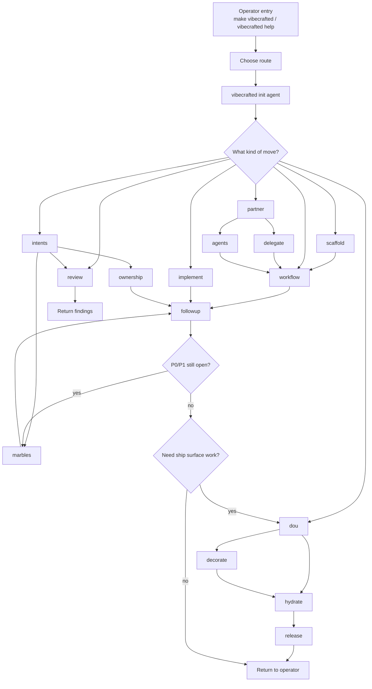

# Workflows

This page documents how the command deck actually chains skills today. It is a
runtime map of `scripts/vibecrafted`, the shared helper layer, and the skill
contracts in `skills/`.

## Operator entry points

- `make vibecrafted` launches the terminal-native installer wizard.
- `make wizard` launches the browser-guided installer surface.
- `vibecrafted help` is the command-deck front door once the framework is installed.
- `vibecrafted init <agent>` is the interactive first context handoff.
- `vibecrafted research --prompt|--file` is the triple-agent swarm launcher.
- `vibecrafted <skill> <agent>` covers the agent-scoped workflow surfaces.

## Framework flow

## Route families

| Surface                      | Start here                                               | Usually chains into                                                          |
| ---------------------------- | -------------------------------------------------------- | ---------------------------------------------------------------------------- |
| New idea or vague scope      | `vibecrafted scaffold <agent>`                           | `workflow`, `partner`, `implement`                                           |
| First repo contact           | `vibecrafted init <agent>`                               | `workflow`, `implement`, `partner`, `review`, `intents`                      |
| Autonomous delivery          | `vibecrafted implement <agent>` (alias: `justdo`)        | `followup`, `marbles`, optionally `dou` / `decorate` / `hydrate` / `release` |
| Shared steering              | `vibecrafted partner <agent>`                            | `delegate`, `agents`, `workflow`, `ownership`                                |
| Truth audit vs original plan | `vibecrafted intents <agent>`                            | `review`, `marbles`, `ownership`                                             |
| Launch-readiness gap finding | `vibecrafted dou <agent>`                                | `hydrate`, `decorate`, `release`                                             |
| Explicit ship path           | `vibecrafted decorate <agent>` or `hydrate` or `release` | `release`                                                                    |

## Runtime contract

- Artifact root: `$VIBECRAFTED_HOME/artifacts/<org>/<repo>/<YYYY_MMDD>/`
- Lock path: `$VIBECRAFTED_HOME/locks/<org>/<repo>/<run_id>.lock`
- Generic agent-spawned runs create `plans/`, `reports/`, `tmp/`, plus `.meta.json`
  and `.transcript.log` sidecars for each report basename.
- `vc-marbles` keeps its ancestor, loop, and watcher outputs under
  `$artifact_root/marbles/`.
- `make vibecrafted` and `make wizard` are installer entry points, not skill
  execution paths; they exist to get the command deck and wrappers onto the machine.

## Next reading

- [SKILLS](./SKILLS.md) for the per-skill route index.
- `skills/<skill>/FLOW.md` for individual flowcharts and CLI schemas.
