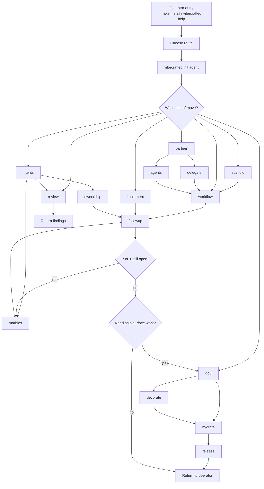

# Workflows

This page documents how the command deck actually chains skills today. It is a
runtime map of `scripts/vibecrafted`, the shared helper layer, and the skill
contracts in `skills/`.

## Operator entry points

- `make install` launches the terminal-native installer wizard.
- `make wizard` launches the browser-guided installer surface.
- `vibecrafted help` is the command-deck front door once the framework is installed.
- `vibecrafted help --all` is the full operator reference.
- `vibecrafted init <agent>` is the interactive first context handoff.
- `vibecrafted research --prompt|--file` is the triple-agent swarm launcher.
- `vibecrafted <skill> <agent>` covers the agent-scoped workflow surfaces.
- `vc-ship <agent> [--prompt|--file]` starts the lifecycle manifest runner for
  Scaffold -> Implement -> Review -> Workflow -> Follow-up -> Marbles -> Audit
  -> Polarize -> DoU -> Hydrate -> Release.
- `vc-dou`, `vc-audit`, `vc-marbles`, `vc-polarize`, and `vc-hydrate` are
  lifecycle wrappers over the same manifest runner for one-stage or paired
  lifecycle passes.
- `vibecrafted dispatch <file.toml>` is the deterministic supervisor lane for
  dispatch manifests and async lifecycle runs.
- `vibecrafted capabilities --json` is the versioned machine-readable workflow
  contract surface (`vibecrafted.workflow_capabilities.v1`): per-workflow
  runtime kind, execution target (`single_agent|swarm`), requested-agent
  policy, and the live research lane selection with its source and any
  configured-but-unsupported agent tokens. Read-only; launches nothing.
- `vibecrafted gui`, `tui`, and `dashboard` are operator surfaces for a second
  visit, not the front door.

## Framework flow

```mermaid
flowchart TD
    A[Operator entry<br/>make install / vibecrafted help] --> B[Choose route]
    B --> C[vibecrafted init agent]
    C --> D{What kind of move?}

    D --> E[scaffold]
    E --> F[workflow]

    D --> F[workflow]
    D --> G[implement]
    D --> H[partner]
    D --> I[intents]
    D --> J[review]
    D --> K[dou]

    H --> L[delegate]
    H --> M[agents]
    L --> F
    M --> F

    I --> J
    I --> N[ownership]
    I --> O[marbles]

    F --> P[followup]
    G --> P
    N --> P

    P --> Q{P0/P1 still open?}
    Q -->|yes| O[marbles]
    O --> P
    Q -->|no| R{Need ship surface work?}

    K --> S[hydrate]
    K --> T[decorate]
    R -->|yes| K
    T --> S
    S --> U[release]

    J --> V[Return findings]
    U --> W[Return to operator]
    R -->|no| W
```

## Route families

| Surface                      | Start here                                               | Usually chains into                                                          |
| ---------------------------- | -------------------------------------------------------- | ---------------------------------------------------------------------------- |
| New idea or vague scope      | `vibecrafted scaffold <agent>`                           | `workflow`, `partner`, `implement`                                           |
| First repo contact           | `vibecrafted init <agent>`                               | `workflow`, `implement`, `partner`, `review`, `intents`                      |
| Autonomous delivery          | `vibecrafted implement <agent>`                          | `followup`, `marbles`, optionally `dou` / `decorate` / `hydrate` / `release` |
| Shared steering              | `vibecrafted partner <agent>`                            | `delegate`, `agents`, `workflow`, `ownership`                                |
| Bounded review               | `vibecrafted review <agent>`                             | `followup`, `marbles`                                                        |
| Post-implementation audit    | `vibecrafted followup <agent>`                           | `marbles`, `dou`, `decorate`, `hydrate`, `release`                           |
| Truth audit vs original plan | `vibecrafted intents <agent>`                            | `review`, `marbles`, `ownership`                                             |
| Launch-readiness gap finding | `vibecrafted dou <agent>`                                | `hydrate`, `decorate`, `release`                                             |
| Explicit ship path           | `vibecrafted decorate <agent>` or `hydrate` or `release` | `release`                                                                    |
| Full lifecycle               | `vc-ship <agent> [--prompt/--file]`                      | Manifest-driven stage baton, optional `--await-stages`                       |
| Deterministic dispatch       | `vibecrafted dispatch <file.toml>`                       | `doctor`, `dry-run`, `resume`, async lifecycle runs                          |

## Runtime contract

- Artifact root: `$VIBECRAFTED_HOME/artifacts/<org>/<repo>/<YYYY_MMDD>/`
- Lock path: `$VIBECRAFTED_HOME/locks/<org>/<repo>/<run_id>.lock`
- Generic agent-spawned runs create `plans/`, `reports/`, `tmp/`, plus `.meta.json`
  and `.transcript.log` sidecars for each report basename.
- `vc-marbles` keeps its ancestor, loop, and watcher outputs under
  `$artifact_root/marbles/`.
- `vc-ship` writes umbrella lifecycle state and a final lifecycle report under
  `$VIBECRAFTED_HOME/control_plane/lifecycle_runs/<run_id>/`; each stage still
  launches through the same core runtime as `vibecrafted <skill> <agent>`.
- `make install` and `make wizard` are installer entry points, not skill
  execution paths; they exist to get the command deck and wrappers onto the machine.
- `vibecrafted implement` is the canonical autonomous delivery command. The
  `justdo` command and `vc-justdo` helper remain aliases for installed agents
  and old prompts, not the official front face.
- All workflows run in the operator's current checkout and current branch.
  Git worktrees are forbidden unless the operator explicitly asks for a
  worktree; "parallel", "isolate", or "clean branch" wording is not enough.
- `vc-review` reviews a bounded target such as PR 14, `HEAD~10..HEAD`, a branch
  diff, or a generated artifact pack. Use `vc-followup` when the question is
  broader: where the implementation is heading, what still feels unfinished,
  and what the next move should be.
- `vc-partner` is shared steering with the user. `vc-ownership` is operational
  ownership by the agent. Both can produce plans; neither silently means
  delegation unless the operator explicitly invokes a delegation path.
- `vc-operator` is an orchestration posture. The live public supervisor command
  is `vibecrafted dispatch`, not `vibecrafted operator`.

## Next reading

- [SKILLS](./SKILLS.md) for the per-skill route index.
- [DOCUMENTATION_MAP](./DOCUMENTATION_MAP.md) for command and documentation truth.
- `skills/<skill>/FLOW.md` for individual flowcharts and CLI schemas.
