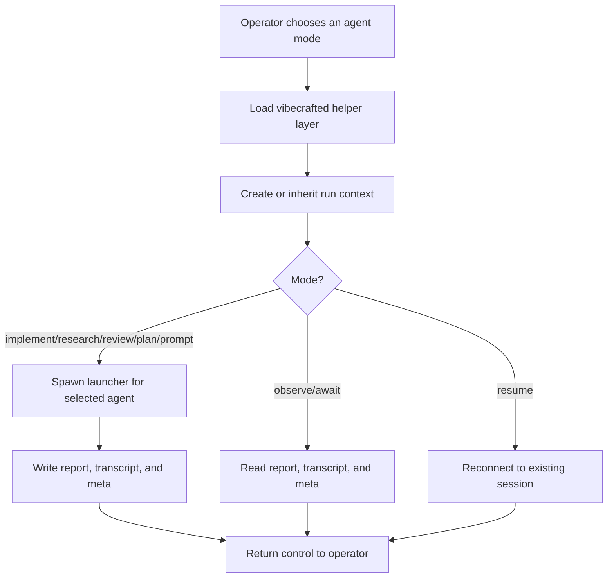

# `vc-agents` Flow

## Flow

## Routes

| Entry                                                                           | Args                                         | Produces                                                           | Exit            |
| ------------------------------------------------------------------------------- | -------------------------------------------- | ------------------------------------------------------------------ | --------------- |
| `vibecrafted agents`                                                            | none                                         | command-deck guidance for agent modes                              | `0` on help     |
| `vibecrafted <agent> implement\|research\|review\|plan\|prompt\|observe\|await` | mode-specific args                           | launcher plus report, transcript, and meta under the artifact root | `0` on dispatch |
| `vibecrafted resume <agent> --session <id>`                                     | `--session`, optional `--prompt` or `--file` | resumed agent session                                              | `0` on dispatch |
| `vc-agents`                                                                     | same as `vibecrafted agents`                 | command-deck guidance                                              | `0` on help     |

### Escalation edges

- Larger parallel cut needed from `vc-partner`, `vc-workflow`, or `vc-ownership` -> use agent modes here.
- Existing run needs inspection -> `vibecrafted <agent> observe --last` or `await --last`.

### Session artifacts

- Artifact root: `$VIBECRAFTED_HOME/artifacts/<org>/<repo>/<YYYY_MMDD>/`
- Lock: `$VIBECRAFTED_HOME/locks/<org>/<repo>/<run_id>.lock`
- Outputs: `reports/<timestamp>_<slug>_<agent>.md` with matching `.transcript.log` and `.meta.json`
