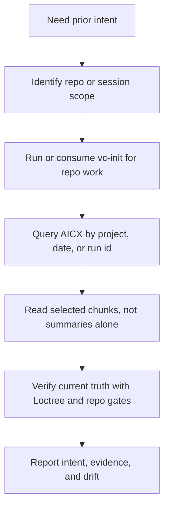

# `vc-aicx` Flow

## Flow

```mermaid
flowchart TD
    A[Need prior intent] --> B[Identify repo or session scope]
    B --> C[Run or consume vc-init for repo work]
    C --> D[Query AICX by project, date, or run id]
    D --> E[Read selected chunks, not summaries alone]
    E --> F[Verify current truth with Loctree and repo gates]
    F --> G[Report intent, evidence, and drift]
```

## Routes

| Entry          | Args                         | Produces                          | Exit              |
| -------------- | ---------------------------- | --------------------------------- | ----------------- |
| `aicx search`  | query + project/date filters | ranked session chunks             | evidence list     |
| `aicx intents` | project scope                | structured intent/outcome records | intent map        |
| `aicx extract` | raw JSON/JSONL/task output   | readable markdown                 | recovered context |

## Evidence Rule

Recovered intent is classified against the live tree as current, stale,
missing, or contradicted. AICX can explain why a path was taken; current
Loctree evidence and repo gates decide whether it is still true.
