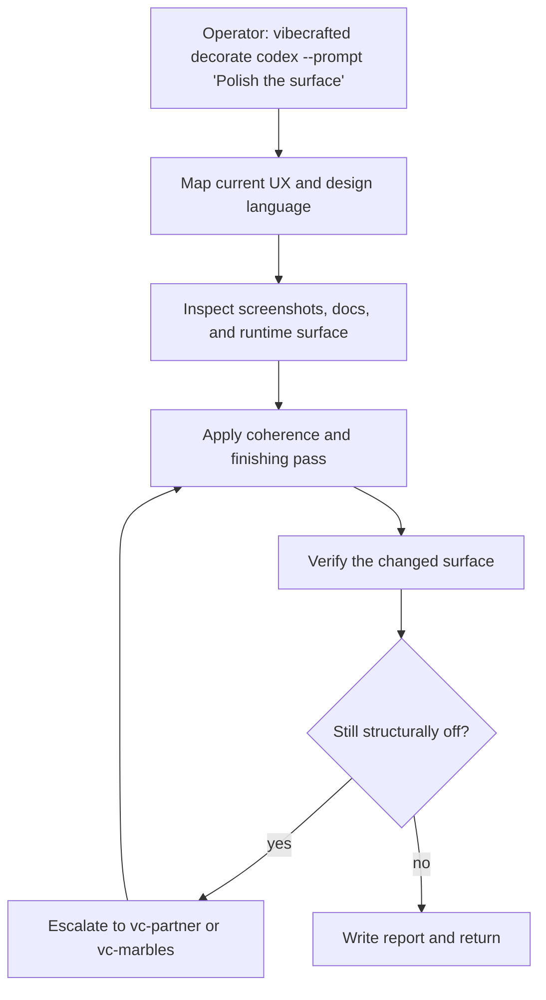

# `vc-decorate` Flow

## Flow

## Routes

| Entry                          | Args                   | Produces                                            | Exit            |
| ------------------------------ | ---------------------- | --------------------------------------------------- | --------------- |
| `vibecrafted decorate <agent>` | `--prompt` or `--file` | decorated surface plus report, transcript, and meta | `0` on dispatch |
| `vc-decorate <agent>`          | same                   | same                                                | `0` on dispatch |

### Escalation edges

- Structural UX problem or unclear intent -> `vibecrafted partner <agent> --prompt 'Co-design the better shape'`
- Verified P0/P1 findings after the polish pass -> `vibecrafted marbles <agent> --prompt 'Converge the remaining issues'`
- Packaging gap discovered while polishing -> `vibecrafted hydrate <agent> --prompt 'Finish the market-facing surface'`

### Session artifacts

- Artifact root: `$VIBECRAFTED_HOME/artifacts/<org>/<repo>/<YYYY_MMDD>/`
- Lock: `$VIBECRAFTED_HOME/locks/<org>/<repo>/<run_id>.lock`
- Outputs: `reports/<timestamp>_<slug>_<agent>.md` with matching `.transcript.log` and `.meta.json`
