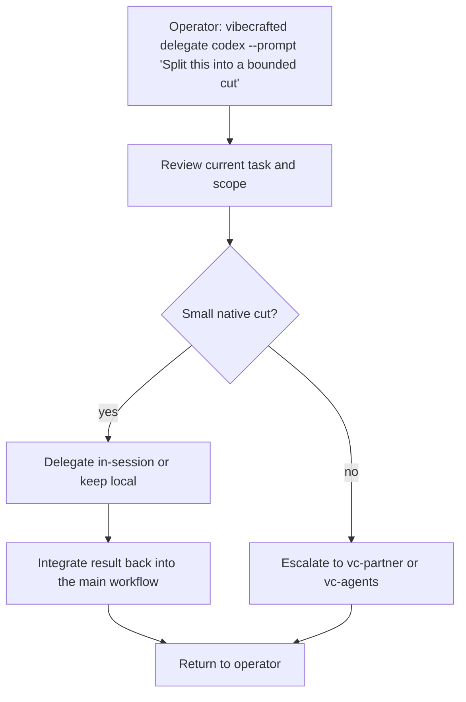

# `vc-delegate` Flow

## Flow

## Routes

| Entry                          | Args                   | Produces                                              | Exit            |
| ------------------------------ | ---------------------- | ----------------------------------------------------- | --------------- |
| `vibecrafted delegate <agent>` | `--prompt` or `--file` | delegation decision plus report, transcript, and meta | `0` on dispatch |
| `vc-delegate <agent>`          | same                   | same                                                  | `0` on dispatch |

### Escalation edges

- Parallel external work is justified -> `vc-agents`
- Shared steering is needed before splitting -> `vc-partner`
- The delegated cut hardens into an implementation pass -> `vc-implement` (legacy alias `vc-justdo`) or `vc-workflow`

### Session artifacts

- Artifact root: `$VIBECRAFTED_HOME/artifacts/<org>/<repo>/<YYYY_MMDD>/`
- Lock: `$VIBECRAFTED_HOME/locks/<org>/<repo>/<run_id>.lock`
- Outputs: `reports/<timestamp>_<slug>_<agent>.md` with matching `.transcript.log` and `.meta.json`
