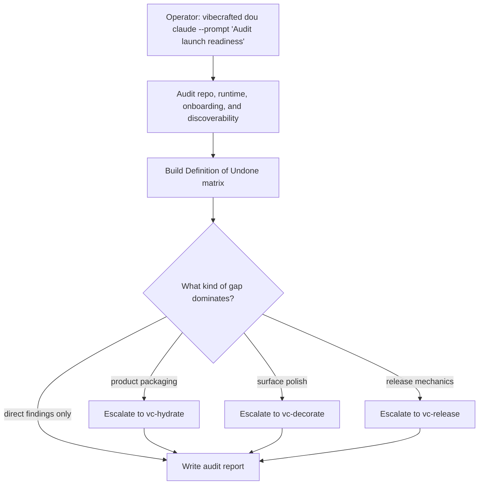

# `vc-dou` Flow

## Flow

## Routes

| Entry                     | Args                   | Produces                                  | Exit            |
| ------------------------- | ---------------------- | ----------------------------------------- | --------------- |
| `vibecrafted dou <agent>` | `--prompt` or `--file` | DoU audit report with transcript and meta | `0` on dispatch |
| `vc-dou <agent>`          | same                   | same                                      | `0` on dispatch |

### Escalation edges

- Packaging, onboarding, or SEO gaps -> `vibecrafted hydrate <agent>`
- Interaction or visual incoherence -> `vibecrafted decorate <agent>`
- Deployment or launch-risk findings -> `vibecrafted release <agent>`

### Session artifacts

- Artifact root: `$VIBECRAFTED_HOME/artifacts/<org>/<repo>/<YYYY_MMDD>/`
- Lock: `$VIBECRAFTED_HOME/locks/<org>/<repo>/<run_id>.lock`
- Outputs: `reports/<timestamp>_<slug>_<agent>.md` with matching `.transcript.log` and `.meta.json`
