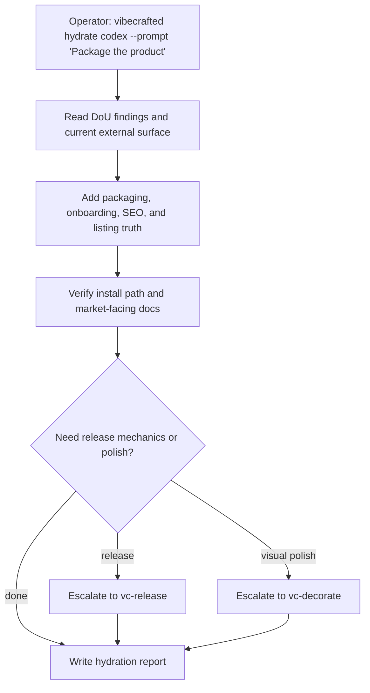

# `vc-hydrate` Flow

## Flow

## Routes

| Entry                         | Args                   | Produces                                                  | Exit            |
| ----------------------------- | ---------------------- | --------------------------------------------------------- | --------------- |
| `vibecrafted hydrate <agent>` | `--prompt` or `--file` | hydrated docs/package/report set plus transcript and meta | `0` on dispatch |
| `vc-hydrate <agent>`          | same                   | same                                                      | `0` on dispatch |

### Escalation edges

- Final outward ship work -> `vibecrafted release <agent>`
- Visual coherence pass on the outward surface -> `vibecrafted decorate <agent>`
- Bigger product-surface gap audit needed -> `vibecrafted dou <agent>`

### Session artifacts

- Artifact root: `$VIBECRAFTED_HOME/artifacts/<org>/<repo>/<YYYY_MMDD>/`
- Lock: `$VIBECRAFTED_HOME/locks/<org>/<repo>/<run_id>.lock`
- Outputs: `reports/<timestamp>_<slug>_<agent>.md` with matching `.transcript.log` and `.meta.json`
