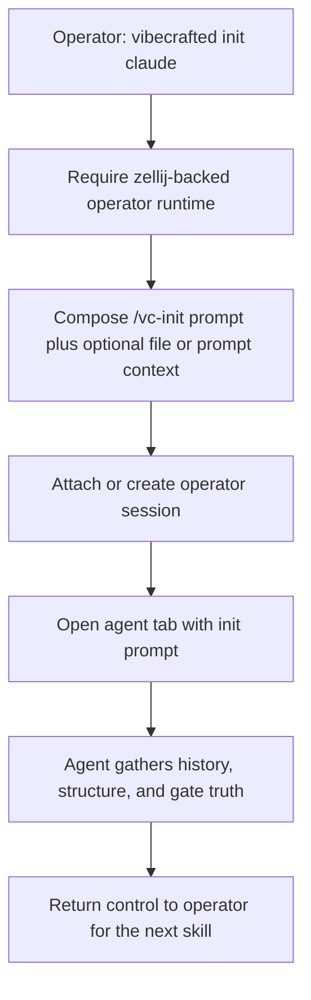

# `vc-init` Flow

## Flow

## Routes

| Entry                      | Args                                                      | Produces                                      | Exit            |
| -------------------------- | --------------------------------------------------------- | --------------------------------------------- | --------------- |
| `vibecrafted init <agent>` | optional `--prompt` or `--file`; interactive runtime only | operator tab/session plus init prompt handoff | `0` on dispatch |
| `vc-init <agent>`          | same                                                      | same                                          | `0` on dispatch |

### Escalation edges

- Need planning next -> `vibecrafted scaffold <agent>` or `workflow`
- Need collaborative steering -> `vibecrafted partner <agent>`
- Need direct delivery next -> `vibecrafted implement <agent>` (legacy alias: `justdo`)

### Session artifacts

- Operator session: zellij session named from the repo base or inherited run context
- Lock: `vc-init` itself does not guarantee a new lock; downstream skills create or inherit it
- Outputs: the spawned agent session writes whatever report, transcript, and meta the next workflow produces
