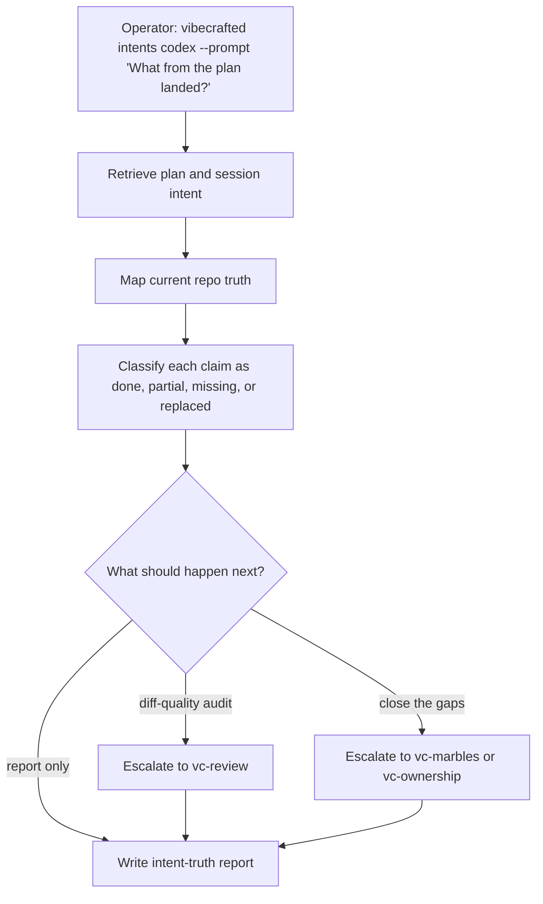

# `vc-intents` Flow

## Flow

## Routes

| Entry                         | Args                         | Produces                                                | Exit            |
| ----------------------------- | ---------------------------- | ------------------------------------------------------- | --------------- |
| `vibecrafted intents <agent>` | `--prompt` or `--file`       | intention-to-runtime audit report, transcript, and meta | `0` on dispatch |
| `vc-intents <agent>`          | same when the wrapper exists | same                                                    | `0` on dispatch |

### Escalation edges

- Current truth needs code review, not reconciliation -> `vibecrafted review <agent>`
- Missing promised work should be closed -> `vibecrafted marbles <agent>` or `ownership`
- Architectural ambiguity remains -> `vibecrafted partner <agent>`

### Session artifacts

- Artifact root: `$VIBECRAFTED_HOME/artifacts/<org>/<repo>/<YYYY_MMDD>/`
- Lock: `$VIBECRAFTED_HOME/locks/<org>/<repo>/<run_id>.lock`
- Outputs: `reports/<timestamp>_<slug>_<agent>.md` with matching `.transcript.log` and `.meta.json`
