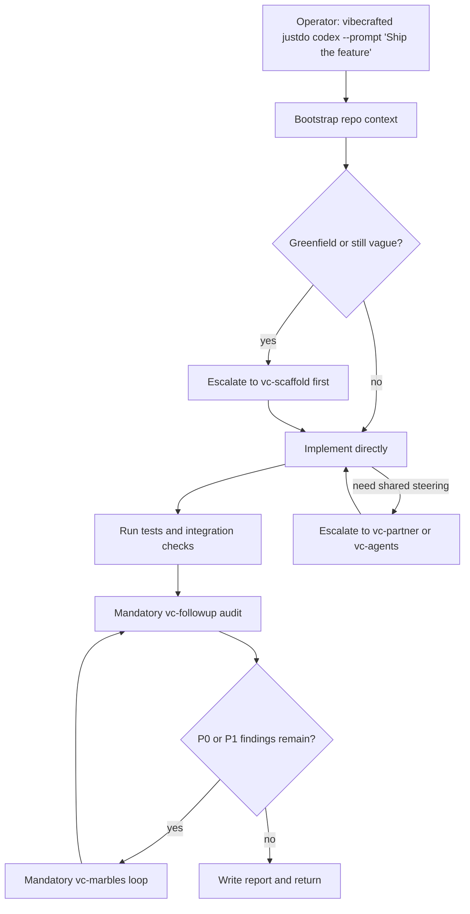

# `vc-justdo` Flow

## Flow

## Routes

| Entry                           | Args                   | Produces                                    | Exit            |
| ------------------------------- | ---------------------- | ------------------------------------------- | --------------- |
| `vibecrafted justdo <agent>`    | `--prompt` or `--file` | implementation report, transcript, and meta | `0` on dispatch |
| `vibecrafted implement <agent>` | alias of `justdo`      | same                                        | `0` on dispatch |
| `vc-justdo <agent>`             | same                   | same                                        | `0` on dispatch |

### Escalation edges

- Scope is still architectural -> `vibecrafted scaffold <agent>`
- Shared steering is needed -> `vibecrafted partner <agent>`
- P0/P1 issues remain -> `vibecrafted marbles <agent>`

### Session artifacts

- Artifact root: `$VIBECRAFTED_HOME/artifacts/<org>/<repo>/<YYYY_MMDD>/`
- Lock: `$VIBECRAFTED_HOME/locks/<org>/<repo>/<run_id>.lock`
- Outputs: `reports/<timestamp>_<slug>_<agent>.md` with matching `.transcript.log` and `.meta.json`
