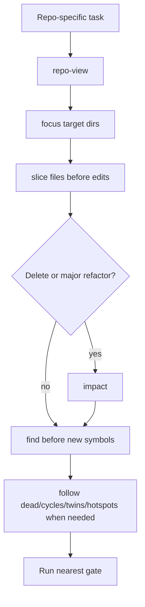

# `vc-loctree` Flow

## Flow

```mermaid
flowchart TD
    A[Repo-specific task] --> B[repo-view]
    B --> C[focus target dirs]
    C --> D[slice files before edits]
    D --> E{Delete or major refactor?}
    E -->|yes| F[impact]
    E -->|no| G[find before new symbols]
    F --> G
    G --> H[follow dead/cycles/twins/hotspots when needed]
    H --> I[Run nearest gate]
```

## Routes

| Entry            | Args         | Produces                   | Exit         |
| ---------------- | ------------ | -------------------------- | ------------ |
| `loct repo-view` | project root | repo overview              | map          |
| `loct focus`     | directory    | module overview            | target map   |
| `loct slice`     | file         | dependencies and consumers | edit context |

## Fallback Rule

Grep or raw file search is fallback evidence only when Loctree cannot answer
the structural question. Record that structural gap so the Loctree surface can
improve.
