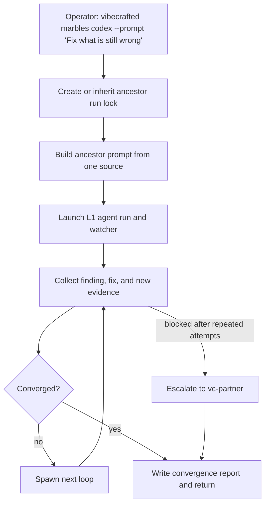

# `vc-marbles` Flow

## Flow

## Routes

| Entry                                                               | Args                                                                  | Produces                                                                  | Exit                   |
| ------------------------------------------------------------------- | --------------------------------------------------------------------- | ------------------------------------------------------------------------- | ---------------------- |
| `vibecrafted marbles <agent>`                                       | exactly one of `--prompt`, `--file`, or `--depth`; optional `--count` | ancestor report plus loop reports, transcripts, and meta under `marbles/` | `0` on launch          |
| `vc-marbles <agent>`                                                | same                                                                  | same                                                                      | `0` on launch          |
| `vibecrafted marbles pause\|stop\|resume\|session\|inspect\|delete` | control args                                                          | marbles runtime control actions                                           | `0` on control success |

### Escalation edges

- Same blocker persists after repeated loops -> `vibecrafted partner <agent>`
- The remaining gap is broader than convergence -> `vibecrafted ownership <agent>`
- The operator wants an audit instead of more loops -> `vibecrafted followup <agent>`

### Session artifacts

- Artifact root: `$VIBECRAFTED_HOME/artifacts/<org>/<repo>/<YYYY_MMDD>/marbles/`
- Lock: `$VIBECRAFTED_HOME/locks/<org>/<repo>/<run_id>.lock`
- Outputs: ancestor reports, loop reports, convergence reports, transcripts, and `.meta.json` sidecars under `marbles/reports/`
