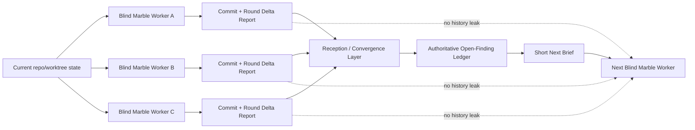

# vc-marbles — Reception / Convergence Protocol

> Operator / orchestrator only.
> Do not load this document into worker-agent context.

## Core idea

Workers are blind on purpose.

Reception is the only place allowed to remember.

Reception owns:

- the authoritative open-finding ledger
- candidate comparison across parallel marble rounds
- delta / stepper math
- acceptance of a winning round
- emission of the next short brief without leaking history back into the worker

## Canonical objects

Let:

- `L_prev` = authoritative open-finding ledger before evaluating the current candidate
- `R_n` = one candidate marble round report
- `A_n` = attacked ids from `R_n`
- `X_n` = resolved ids from `R_n`
- `S_n` = still-open ids from `R_n`
- `D_n` = discovered open ids from `R_n`
- `G_n` = regression ids from `R_n`

The next authoritative ledger is:

```text
L_curr = (L_prev - X_n) ∪ S_n ∪ D_n ∪ G_n
```

Interpretation:

- unresolved old issues stay open unless explicitly resolved
- blind workers do not need to know the whole ledger
- reception performs the merge

## Severity weights

Use stable numeric weights for comparison:

```text
high   = 3
medium = 2
low    = 1
```

Define:

`W(set) = sum(weight(item.severity) for each unique item in set)`

## Derived sets

Reception computes:

- `closed = L_prev ∩ X_n`
- `opened = (D_n ∪ G_n) - L_prev`
- `instant_fixes = X_n - L_prev`

Meaning:

- `closed` = previously known open issues that this round actually closed
- `opened` = new open fragility introduced or discovered this round
- `instant_fixes` = issues discovered and fixed inside the same round before they ever entered the ledger

## Metrics

### Raw delta

`delta_raw = |L_prev| - |L_curr|`

### Weighted delta

`delta_weighted = W(L_prev) - W(L_curr)`

This is the authoritative net change in global open chaos.

### Stepper coefficient

`stepper = (W(closed) + W(instant_fixes) - W(opened)) / max(W(A_n), 1)`

Interpretation:

- `stepper > 0` → the chosen step reduced more fragility than it opened
- `stepper = 0` → the step was locally neutral
- `stepper < 0` → the step opened more chaos than it removed

This is a local cycle-quality metric.
It measures whether the chosen step was good, not just whether the global backlog moved.

### Convergence rate

`convergence_rate = delta_weighted / max(W(L_prev), 1)`

This is the global backlog shrink rate.

## Gate clamp

If `R_n.gate == fail`, clamp both local and global optimism:

```text
stepper = min(stepper, 0)
convergence_rate = min(convergence_rate, 0)
```

A failed gate is not allowed to masquerade as healthy convergence.

## First round baseline

If no accepted prior report exists:

- accept the first valid report as the baseline merge
- set `delta_raw = 0`
- set `delta_weighted = 0`
- set `stepper = 0`
- set `convergence_rate = 0`

Round 1 establishes the ledger.
Round 2 starts measurable convergence.

## Parallel candidate selection

If multiple blind marble rounds run against the same baseline, evaluate them independently against the same `L_prev`.

Choose the winner in this order:

1. gate pass beats gate fail
2. higher `delta_weighted`
3. higher `stepper`
4. lower regression count
5. smaller touched surface (`files_touched`)
6. higher `tests_added`
7. operator decision if still tied

Rejected candidates are archived only.
Their narrative must not seed the next worker.

## Acceptance and ledger update

For the accepted candidate:

```text
L_next = (L_prev - X_n) ∪ S_n ∪ D_n ∪ G_n
```

Persist:

- `L_next`
- accepted report path
- `delta_raw`
- `delta_weighted`
- `stepper`
- `convergence_rate`

Reception is the only place where this state is remembered.

## Next brief construction

The next worker may receive only:

- current repo/worktree path
- operator constraints
- at most one short target hint derived from the dominant remaining cluster

Examples of valid short hints:

- `focus: release/operator-session`
- `focus: access/orders-create`
- `focus: errors/stripe-webhook`

The next worker must not receive:

- previous report text
- delta numbers
- stepper numbers
- candidate rankings
- “what the last worker did”
- a narrative history of the loop

Blindness is a feature, not a limitation.

## Decision rules

### STOP

Stop the loop when:

- `L_next` is empty, or
- only operator-accepted debt remains in the ledger

### CONTINUE SAME SURFACE

Continue on the same surface when:

- `stepper > 0`, and
- the highest-weight remaining cluster is still the same area

### SHIFT SURFACE

Shift to another surface when:

- `stepper <= 0` for two accepted rounds, or
- the dominant remaining cluster changes, or
- the current cluster is no longer the highest weighted risk

### ESCALATE

Escalate to operator review when:

- gate fails twice on the same cluster
- `delta_weighted < 0` twice in a row
- parallel candidates conflict structurally
- the branch/worktree situation stops safe continuation
- external dependency or product decision blocks progress

## Operator note

The worker is not supposed to be clever about the loop.

The system becomes clever because reception:

- remembers
- compares
- scores
- routes

That is where convergence lives.

## Architecture


