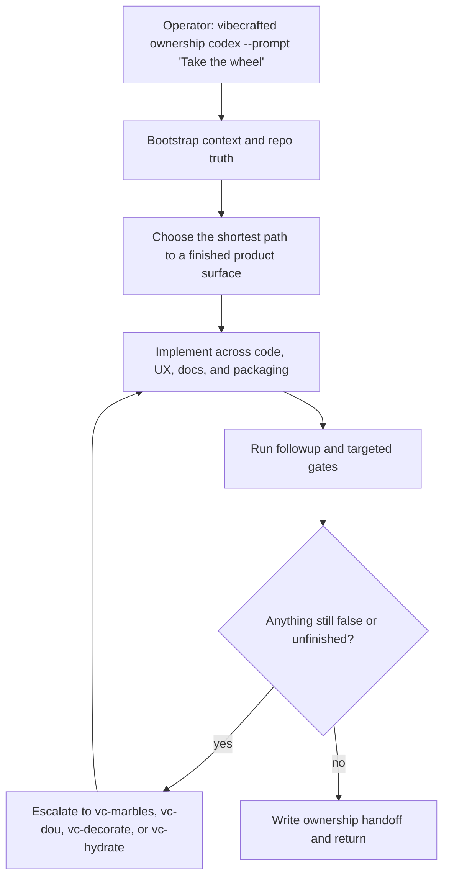

# `vc-ownership` Flow

## Flow

## Routes

| Entry                           | Args                         | Produces                                         | Exit            |
| ------------------------------- | ---------------------------- | ------------------------------------------------ | --------------- |
| `vibecrafted ownership <agent>` | `--prompt` or `--file`       | end-to-end delivery report, transcript, and meta | `0` on dispatch |
| `vc-ownership <agent>`          | same when the wrapper exists | same                                             | `0` on dispatch |

### Escalation edges

- Need shared steering on a risky decision -> `vibecrafted partner <agent>`
- Need more execution units -> `vc-agents`
- Remaining P0/P1 issues after implementation -> `vibecrafted marbles <agent>`

### Session artifacts

- Artifact root: `$VIBECRAFTED_HOME/artifacts/<org>/<repo>/<YYYY_MMDD>/`
- Lock: `$VIBECRAFTED_HOME/locks/<org>/<repo>/<run_id>.lock`
- Outputs: `reports/<timestamp>_<slug>_<agent>.md` with matching `.transcript.log` and `.meta.json`
