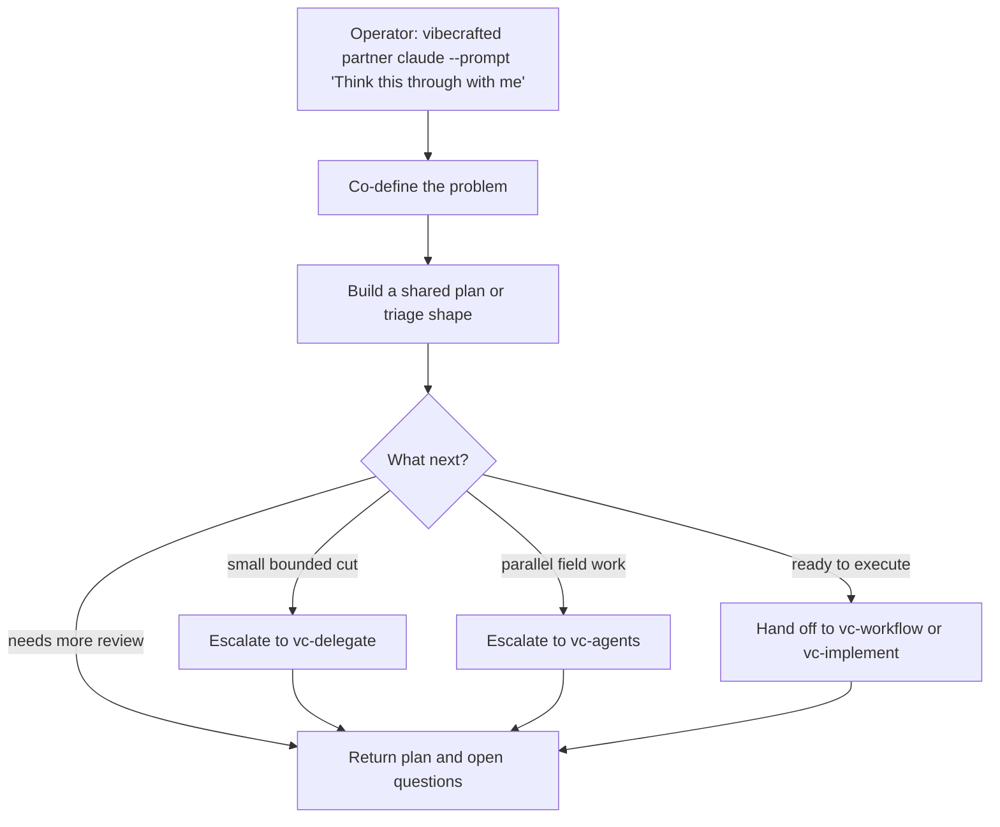

# `vc-partner` Flow

## Flow

## Routes

| Entry                         | Args                   | Produces                                              | Exit            |
| ----------------------------- | ---------------------- | ----------------------------------------------------- | --------------- |
| `vibecrafted partner <agent>` | `--prompt` or `--file` | shared plan or triage report plus transcript and meta | `0` on dispatch |
| `vc-partner <agent>`          | same                   | same                                                  | `0` on dispatch |

### Escalation edges

- Small native cut inside the same session -> `vibecrafted delegate <agent>`
- Need separate execution units -> `vc-agents`
- Ready for autonomous implementation -> `vibecrafted implement <agent>` (legacy alias: `justdo`)

### Session artifacts

- Artifact root: `$VIBECRAFTED_HOME/artifacts/<org>/<repo>/<YYYY_MMDD>/`
- Lock: `$VIBECRAFTED_HOME/locks/<org>/<repo>/<run_id>.lock`
- Outputs: `reports/<timestamp>_<slug>_<agent>.md` with matching `.transcript.log` and `.meta.json`
