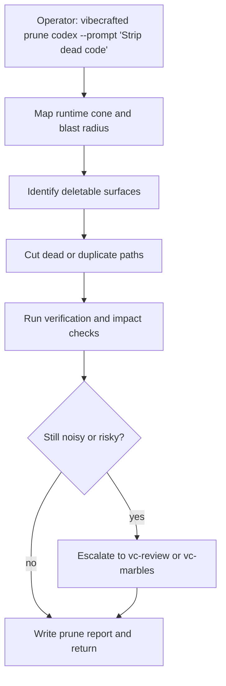

# `vc-prune` Flow

## Flow

## Routes

| Entry                       | Args                   | Produces                             | Exit            |
| --------------------------- | ---------------------- | ------------------------------------ | --------------- |
| `vibecrafted prune <agent>` | `--prompt` or `--file` | pruning report, transcript, and meta | `0` on dispatch |
| `vc-prune <agent>`          | same                   | same                                 | `0` on dispatch |

### Escalation edges

- Need a findings-first audit before deleting -> `vibecrafted review <agent>`
- Deletions reveal new counterexamples -> `vibecrafted marbles <agent>`
- Wider product-surface cleanup is needed -> `vibecrafted ownership <agent>`

### Session artifacts

- Artifact root: `$VIBECRAFTED_HOME/artifacts/<org>/<repo>/<YYYY_MMDD>/`
- Lock: `$VIBECRAFTED_HOME/locks/<org>/<repo>/<run_id>.lock`
- Outputs: `reports/<timestamp>_<slug>_<agent>.md` with matching `.transcript.log` and `.meta.json`
