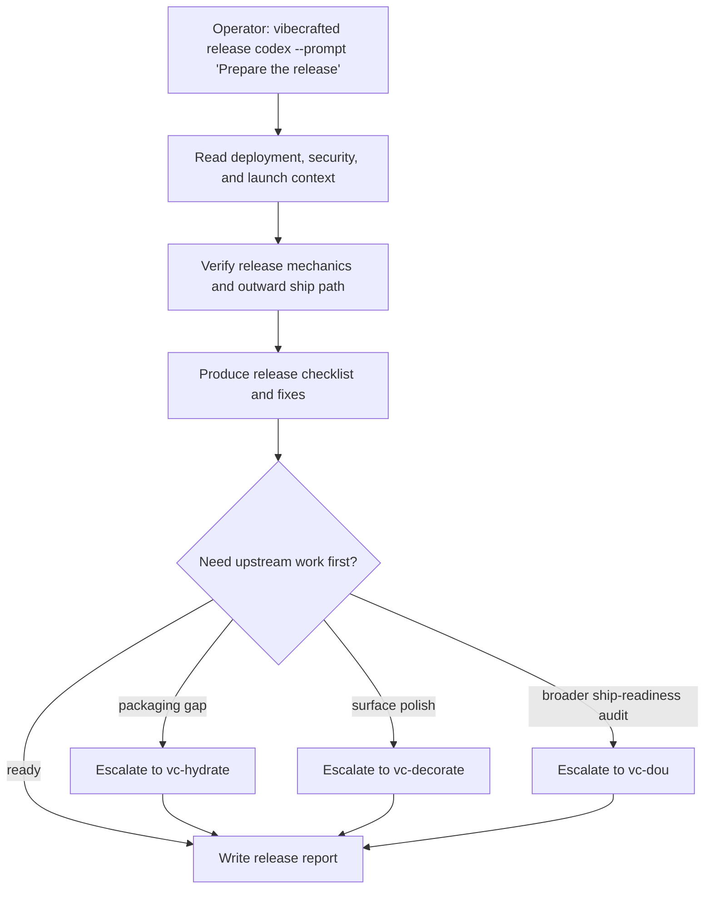

# `vc-release` Flow

## Flow

## Routes

| Entry                         | Args                   | Produces                             | Exit            |
| ----------------------------- | ---------------------- | ------------------------------------ | --------------- |
| `vibecrafted release <agent>` | `--prompt` or `--file` | release report, transcript, and meta | `0` on dispatch |
| `vc-release <agent>`          | same                   | same                                 | `0` on dispatch |

### Escalation edges

- Packaging or onboarding is still unfinished -> `vibecrafted hydrate <agent>`
- Visual release surface needs polish -> `vibecrafted decorate <agent>`
- The product is not actually shippable yet -> `vibecrafted dou <agent>`

### Session artifacts

- Artifact root: `$VIBECRAFTED_HOME/artifacts/<org>/<repo>/<YYYY_MMDD>/`
- Lock: `$VIBECRAFTED_HOME/locks/<org>/<repo>/<run_id>.lock`
- Outputs: `reports/<timestamp>_<slug>_<agent>.md` with matching `.transcript.log` and `.meta.json`
