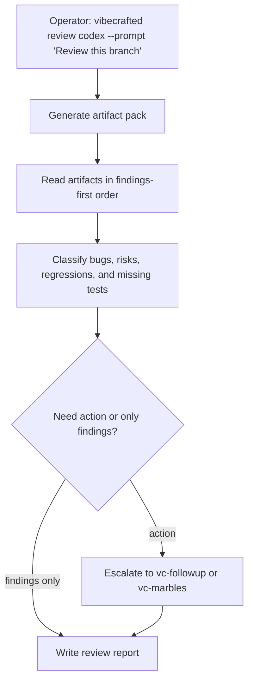

# `vc-review` Flow

## Flow

## Routes

| Entry                        | Args                   | Produces                            | Exit            |
| ---------------------------- | ---------------------- | ----------------------------------- | --------------- |
| `vibecrafted review <agent>` | `--prompt` or `--file` | review report, transcript, and meta | `0` on dispatch |
| `vc-review <agent>`          | same                   | same                                | `0` on dispatch |

### Escalation edges

- Findings should be turned into a fix plan -> `vibecrafted followup <agent>`
- Findings should be closed in convergence loops -> `vibecrafted marbles <agent>`
- The review exposes a bigger architectural decision -> `vibecrafted partner <agent>`

### Session artifacts

- Artifact root: `$VIBECRAFTED_HOME/artifacts/<org>/<repo>/<YYYY_MMDD>/`
- Lock: `$VIBECRAFTED_HOME/locks/<org>/<repo>/<run_id>.lock`
- Outputs: `reports/<timestamp>_<slug>_<agent>.md` with matching `.transcript.log` and `.meta.json`
