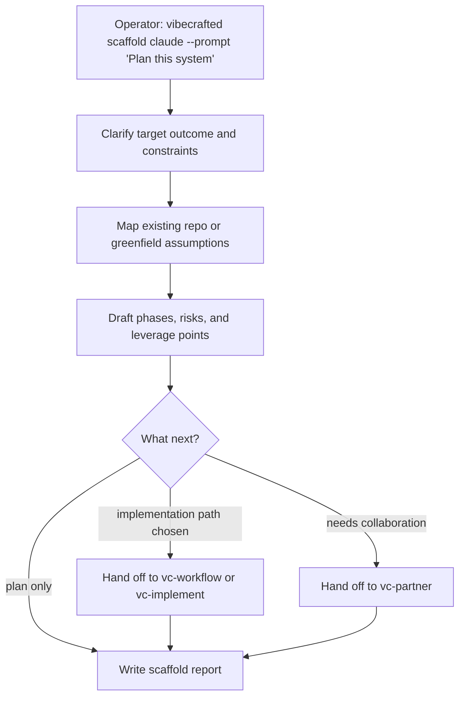

# `vc-scaffold` Flow

## Flow

## Routes

| Entry                          | Args                   | Produces                                   | Exit            |
| ------------------------------ | ---------------------- | ------------------------------------------ | --------------- |
| `vibecrafted scaffold <agent>` | `--prompt` or `--file` | scaffold plan/report, transcript, and meta | `0` on dispatch |
| `vc-scaffold <agent>`          | same                   | same                                       | `0` on dispatch |

### Escalation edges

- Plan is ready for execution -> `vibecrafted workflow <agent>` or `implement` (legacy alias: `justdo`)
- Shared steering is still needed -> `vibecrafted partner <agent>`
- The repo already exists and needs truth before planning -> `vibecrafted init <agent>`

### Session artifacts

- Artifact root: `$VIBECRAFTED_HOME/artifacts/<org>/<repo>/<YYYY_MMDD>/`
- Lock: `$VIBECRAFTED_HOME/locks/<org>/<repo>/<run_id>.lock`
- Outputs: `reports/<timestamp>_<slug>_<agent>.md` with matching `.transcript.log` and `.meta.json`
