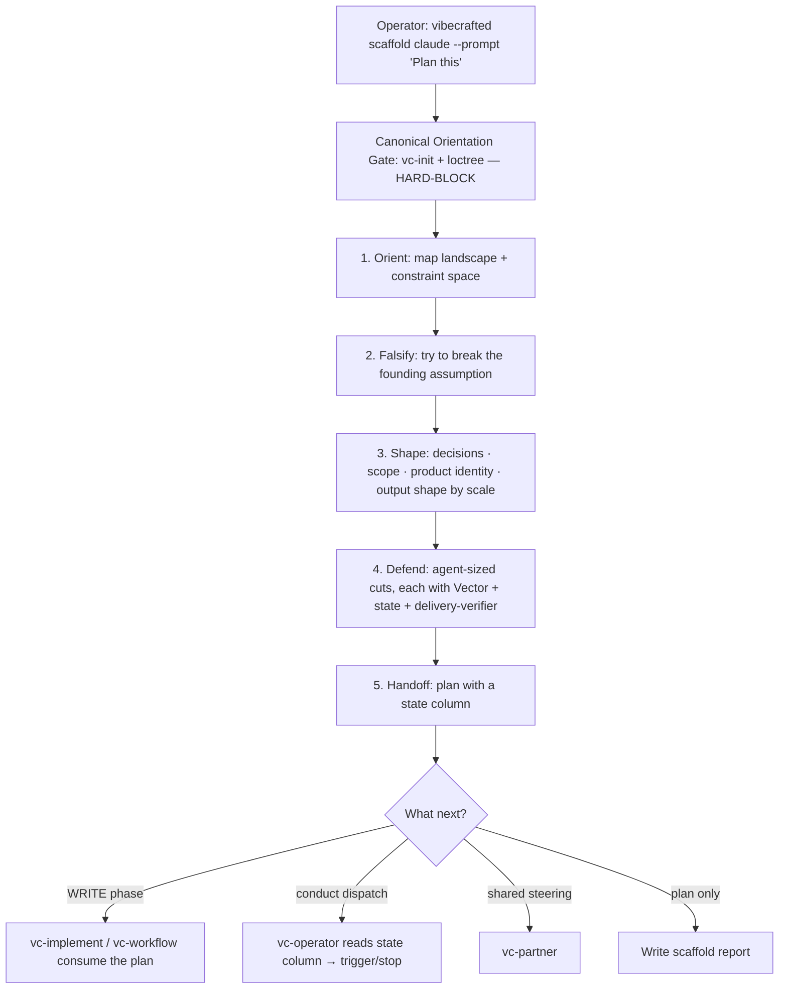

# `vc-scaffold` Flow

## Flow

```mermaid
flowchart TD
    A[Operator: vibecrafted scaffold claude --prompt 'Plan this'] --> G[Canonical Orientation Gate: vc-init + loctree — HARD-BLOCK]
    G --> O[1. Orient: map landscape + constraint space]
    O --> F[2. Falsify: try to break the founding assumption]
    F --> S[3. Shape: decisions · scope · product identity · output shape by scale]
    S --> D[4. Defend: agent-sized cuts, each with Vector + state + delivery-verifier]
    D --> H[5. Handoff: plan with a state column]
    H --> E{What next?}
    E -->|WRITE phase| W[vc-implement / vc-workflow consume the plan]
    E -->|conduct dispatch| OP[vc-operator reads state column → trigger/stop]
    E -->|shared steering| P[vc-partner]
    E -->|plan only| R[Write scaffold report]
```

## Cadence position

Scaffold is the **WRITE entry** of the VC-ship read/write cadence
(Scaffold→Implement→Review→Workflow→Follow-up→Marbles→Audit→Polarize→Dou→Hydrate→Release).
Each WRITE leaves an artifact; the next READ falsifies it. See `references/cadence.md`.

## Routes

| Entry                          | Args                   | Produces                                              | Exit            |
| ------------------------------ | ---------------------- | ----------------------------------------------------- | --------------- |
| `vibecrafted scaffold <agent>` | `--prompt` or `--file` | scaffold plan (with `state` column), transcript, meta | `0` on dispatch |
| `vc-scaffold <agent>`          | same                   | same                                                  | `0` on dispatch |

### Escalation edges

- Plan ready for execution -> `vibecrafted implement <agent>` (alias `justdo`) or `workflow`
- Conduct a multi-wave dispatch -> `vibecrafted operator` (reads the `state` column for trigger/stop)
- Shared steering still needed -> `vibecrafted partner <agent>`
- Repo already exists and needs truth before planning -> `vibecrafted init <agent>`

### Session artifacts

- Artifact root: `$VIBECRAFTED_HOME/artifacts/<org>/<repo>/<YYYY_MMDD>/`
- Lock: `$VIBECRAFTED_HOME/locks/<org>/<repo>/<run_id>.lock`
- Outputs: `reports/<timestamp>_<slug>_<agent>.md` with matching `.transcript.log` and `.meta.json`
