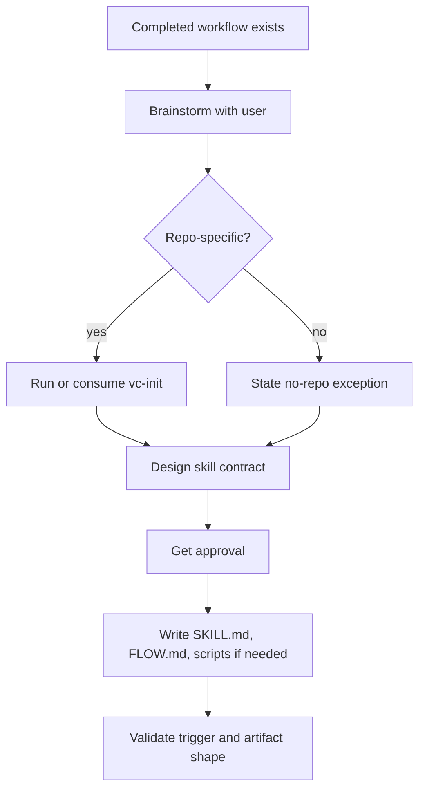

# `vc-skillaunch` Flow

## Flow

```mermaid
flowchart TD
    A[Completed workflow exists] --> B[Brainstorm with user]
    B --> C{Repo-specific?}
    C -->|yes| D[Run or consume vc-init]
    C -->|no| E[State no-repo exception]
    D --> F[Design skill contract]
    E --> F
    F --> G[Get approval]
    G --> H[Write SKILL.md, FLOW.md, scripts if needed]
    H --> I[Validate trigger and artifact shape]
```

## Routes

| Entry           | Args                       | Produces               | Exit                  |
| --------------- | -------------------------- | ---------------------- | --------------------- |
| `vc-skillaunch` | completed workflow context | reusable skill package | installed skill draft |

## Validation Rule

The resulting skill must be invokable and followable without hidden context
from the original conversation. If a future agent needs an unspoken assumption,
the skill is not done.
