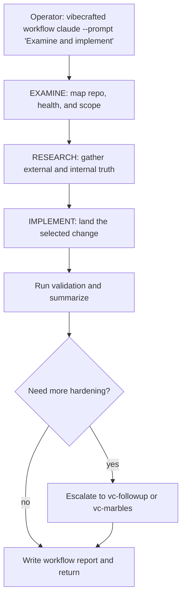

# `vc-workflow` Flow

## Flow

## Routes

| Entry                          | Args                   | Produces                              | Exit            |
| ------------------------------ | ---------------------- | ------------------------------------- | --------------- |
| `vibecrafted workflow <agent>` | `--prompt` or `--file` | workflow report, transcript, and meta | `0` on dispatch |
| `vc-workflow <agent>`          | same                   | same                                  | `0` on dispatch |

### Escalation edges

- Shared steering is needed before implementation -> `vibecrafted partner <agent>`
- The best shape is already obvious and should be shipped directly -> `vibecrafted implement <agent>` (legacy alias: `justdo`)
- Validation finds remaining P0/P1s -> `vibecrafted marbles <agent>`

### Session artifacts

- Artifact root: `$VIBECRAFTED_HOME/artifacts/<org>/<repo>/<YYYY_MMDD>/`
- Lock: `$VIBECRAFTED_HOME/locks/<org>/<repo>/<run_id>.lock`
- Outputs: `reports/<timestamp>_<slug>_<agent>.md` with matching `.transcript.log` and `.meta.json`
