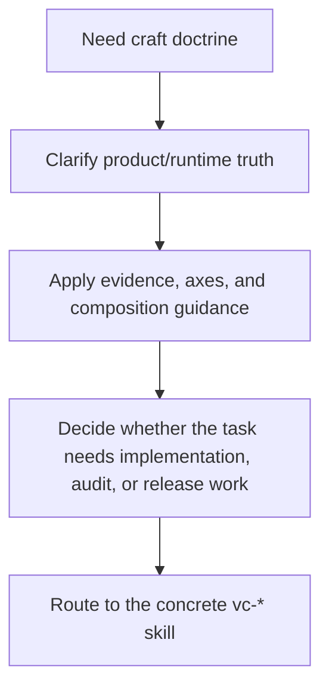

# `vibecraftsmanship` Flow

## Flow

```mermaid
flowchart TD
    A[Need craft doctrine] --> B[Clarify product/runtime truth]
    B --> C[Apply evidence, axes, and composition guidance]
    C --> D[Decide whether the task needs implementation, audit, or release work]
    D --> E[Route to the concrete vc-* skill]
```

## Routes

| Entry               | Args                              | Produces                   | Exit             |
| ------------------- | --------------------------------- | -------------------------- | ---------------- |
| `vibecraftsmanship` | conceptual/product-quality prompt | doctrine-grounded guidance | routed next move |

## Convergence Rule

Choose the smallest honest path to shipping, then converge through inspection,
counterexamples, and verification. Report the next truth instead of claiming
premature completion.
