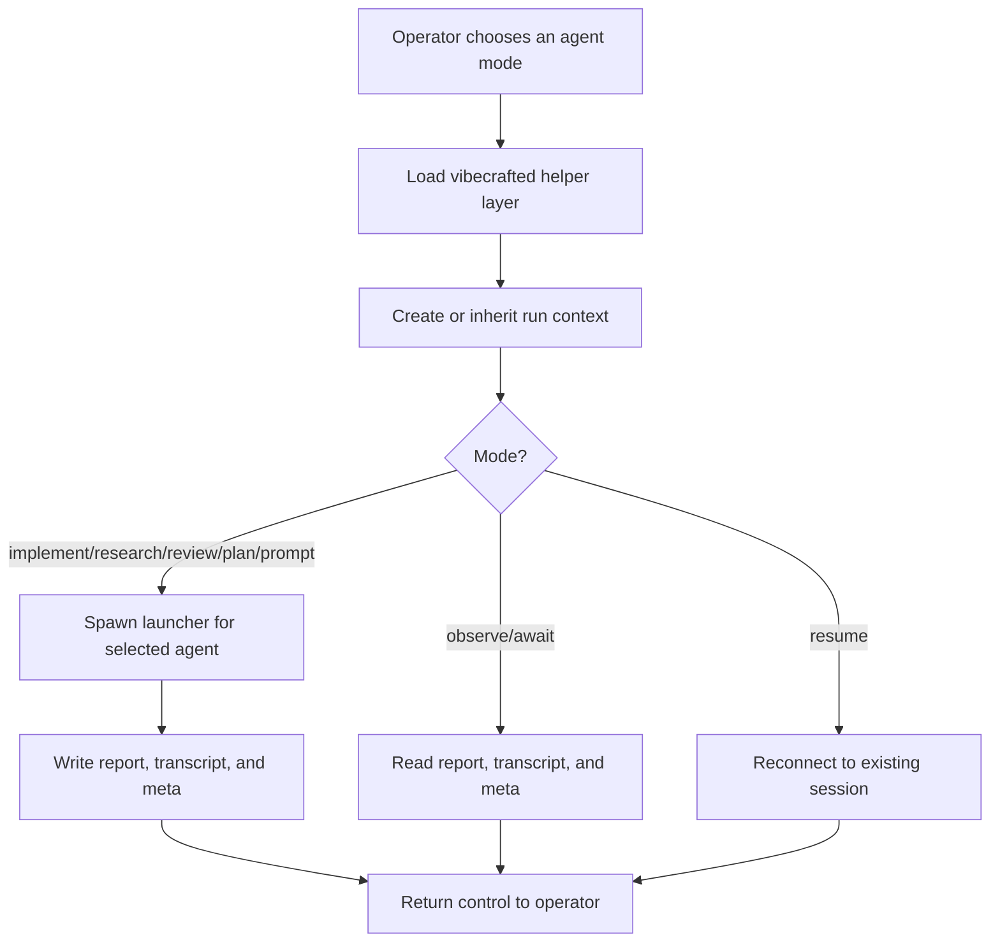

# `vc-agents` Flow

## Flow

## Trasy

| Wejście                                                                         | Argumenty                                        | Produkuje                                                        | Wyjście            |
| ------------------------------------------------------------------------------- | ------------------------------------------------ | ---------------------------------------------------------------- | ------------------ |
| `vibecrafted agents`                                                            | brak                                             | wskazówki command-decka dla trybów agentów                       | `0` przy pomocy    |
| `vibecrafted <agent> implement\|research\|review\|plan\|prompt\|observe\|await` | argumenty specyficzne dla trybu                  | launcher plus report, transcript i meta pod korzeniem artefaktów | `0` przy dispatchu |
| `vibecrafted resume <agent> --session <id>`                                     | `--session`, opcjonalnie `--prompt` lub `--file` | wznowiona sesja agenta                                           | `0` przy dispatchu |
| `vc-agents`                                                                     | tak samo jak `vibecrafted agents`                | wskazówki command-decka                                          | `0` przy pomocy    |

### Krawędzie eskalacji

- Potrzeba większego równoległego cięcia z `vc-partner`, `vc-workflow` lub `vc-ownership` -> użyj tutaj trybów agentów.
- Istniejący run wymaga inspekcji -> `vibecrafted <agent> observe --last` lub `await --last`.

### Artefakty sesji

- Korzeń artefaktów: `$VIBECRAFTED_HOME/artifacts/<org>/<repo>/<YYYY_MMDD>/`
- Lock: `$VIBECRAFTED_HOME/locks/<org>/<repo>/<run_id>.lock`
- Wyjścia: `reports/<timestamp>_<slug>_<agent>.md` z pasującymi `.transcript.log` i `.meta.json`
