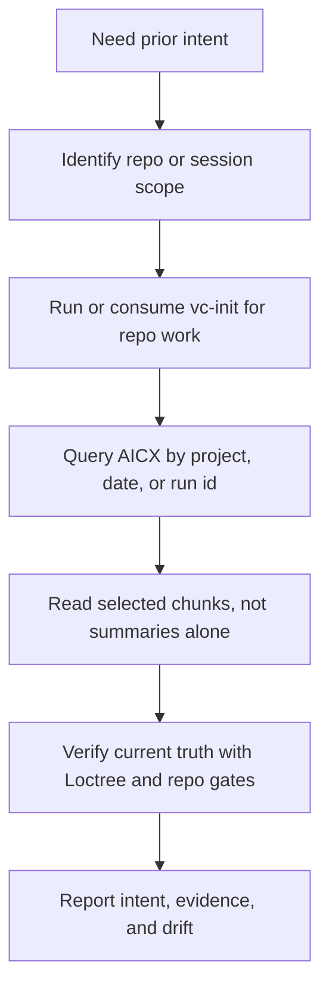

# `vc-aicx` Flow

## Flow

## Trasy

| Wejście        | Argumenty                       | Produkuje                                 | Wyjście            |
| -------------- | ------------------------------- | ----------------------------------------- | ------------------ |
| `aicx search`  | zapytanie + filtry project/date | rankowane chunki sesji                    | lista evidence     |
| `aicx intents` | scope projektu                  | ustrukturyzowane rekordy intencji/wyników | mapa intencji      |
| `aicx extract` | surowe wyjście JSON/JSONL/task  | czytelny markdown                         | odzyskany kontekst |

## Reguła Evidence

Odzyskana intencja jest klasyfikowana względem żywego drzewa jako aktualna,
nieaktualna (stale), brakująca lub zaprzeczona. AICX potrafi wyjaśnić, dlaczego
obrano daną ścieżkę; to bieżące evidence z Loctree i bramki repo decydują, czy
nadal jest prawdziwa.
