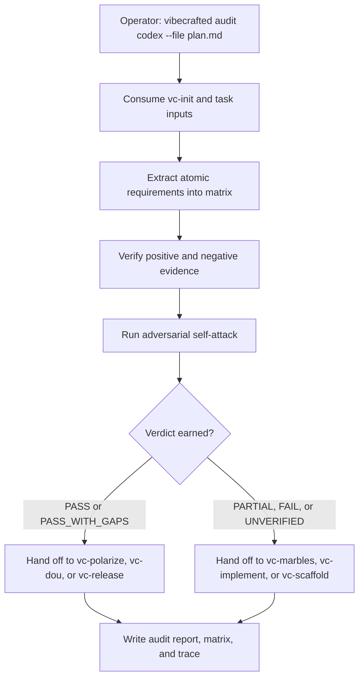

# `vc-audit` Flow

## Flow

## Trasy

| Wejście                     | Argumenty               | Produkuje                                        | Wyjście            |
| --------------------------- | ----------------------- | ------------------------------------------------ | ------------------ |
| `vibecrafted audit <agent>` | `--prompt` lub `--file` | raport auditu, matryca wymagań, trace i metadane | `0` przy dispatchu |
| `vc-audit <agent>`          | jak wyżej               | jak wyżej                                        | `0` przy dispatchu |
| `vc-verify <agent>`         | jak wyżej               | jak wyżej                                        | `0` przy dispatchu |

### Krawędzie eskalacji

- PASS / PASS_WITH_GAPS potrzebuje gotowości powierzchni produktu -> `vibecrafted dou <agent>`
- PASS / PASS_WITH_GAPS potrzebuje finalnej mechaniki release'u -> `vibecrafted release <agent>`
- Luki PARTIAL / UNVERIFIED wymagają zbieżności -> `vibecrafted marbles <agent>`
- FAIL oznacza, że kształt specu lub implementacji jest zły -> `vibecrafted scaffold <agent>`

### Artefakty sesji

- Korzeń artefaktów: `$VIBECRAFTED_HOME/artifacts/<org>/<repo>/<YYYY_MMDD>/`
- Lock: `$VIBECRAFTED_HOME/locks/<org>/<repo>/<run_id>.lock`
- Wyjścia: `reports/audit_report.md`, `reports/audit_requirements_matrix.jsonl` oraz `reports/audit_trace.log`

### Reguła evidence

Falsyfikuj każde twierdzenie wobec kodu, testów, dokumentów i evidence z runtime'u. Findingi
idą pierwsze, uporządkowane wg severity; podsumowania pozostają drugorzędne.
