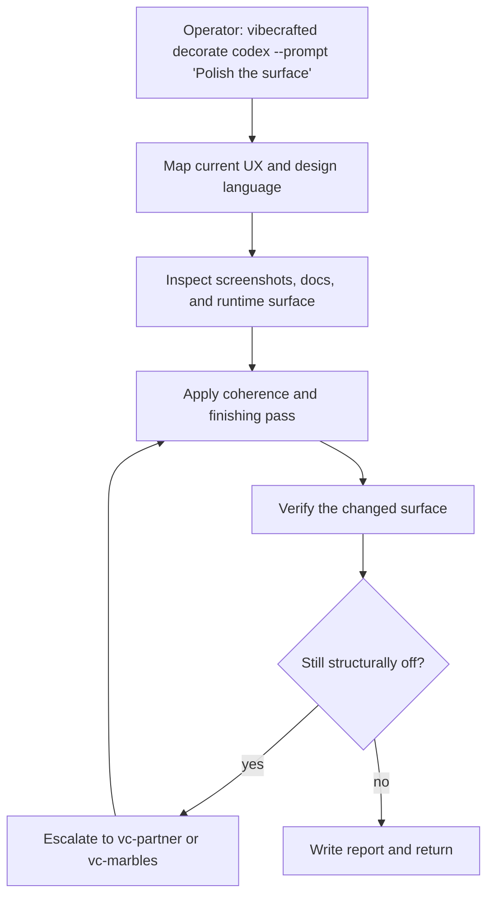

# `vc-decorate` Flow

## Flow

## Trasy

| Wejście                        | Argumenty               | Produkuje                                               | Wyjście            |
| ------------------------------ | ----------------------- | ------------------------------------------------------- | ------------------ |
| `vibecrafted decorate <agent>` | `--prompt` lub `--file` | udekorowana powierzchnia plus report, transcript i meta | `0` przy dispatchu |
| `vc-decorate <agent>`          | tak samo                | tak samo                                                | `0` przy dispatchu |

### Krawędzie eskalacji

- Strukturalny problem UX lub niejasna intencja -> `vibecrafted partner <agent> --prompt 'Co-design the better shape'`
- Zweryfikowane findingi P0/P1 po przebiegu szlifu -> `vibecrafted marbles <agent> --prompt 'Converge the remaining issues'`
- Luka w pakowaniu odkryta podczas szlifu -> `vibecrafted hydrate <agent> --prompt 'Finish the market-facing surface'`

### Artefakty sesji

- Korzeń artefaktów: `$VIBECRAFTED_HOME/artifacts/<org>/<repo>/<YYYY_MMDD>/`
- Lock: `$VIBECRAFTED_HOME/locks/<org>/<repo>/<run_id>.lock`
- Wyjścia: `reports/<timestamp>_<slug>_<agent>.md` z pasującymi `.transcript.log` i `.meta.json`
