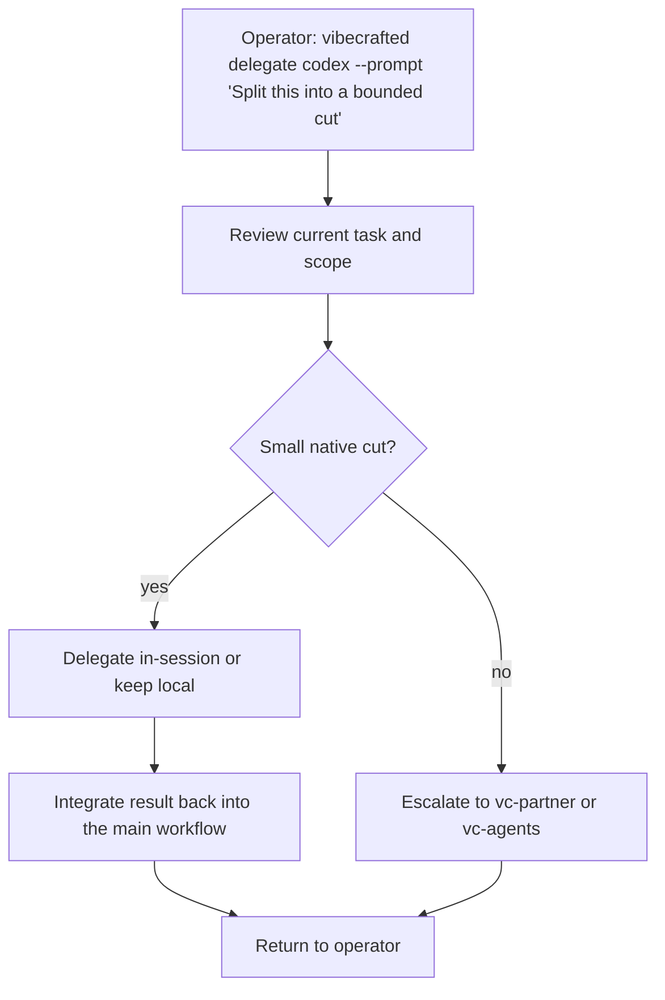

# `vc-delegate` Flow

## Flow

## Trasy

| Wejście                        | Argumenty               | Produkuje                                          | Wyjście            |
| ------------------------------ | ----------------------- | -------------------------------------------------- | ------------------ |
| `vibecrafted delegate <agent>` | `--prompt` lub `--file` | decyzja o delegacji plus report, transcript i meta | `0` przy dispatchu |
| `vc-delegate <agent>`          | tak samo                | tak samo                                           | `0` przy dispatchu |

### Krawędzie eskalacji

- Równoległa praca zewnętrzna jest uzasadniona -> `vc-agents`
- Potrzebne jest współdzielone sterowanie przed podziałem -> `vc-partner`
- Delegowane cięcie krzepnie w przebieg implementacyjny -> `vc-implement` (alias `vc-justdo`) lub `vc-workflow`

### Artefakty sesji

- Korzeń artefaktów: `$VIBECRAFTED_HOME/artifacts/<org>/<repo>/<YYYY_MMDD>/`
- Lock: `$VIBECRAFTED_HOME/locks/<org>/<repo>/<run_id>.lock`
- Wyjścia: `reports/<timestamp>_<slug>_<agent>.md` z pasującymi `.transcript.log` i `.meta.json`
