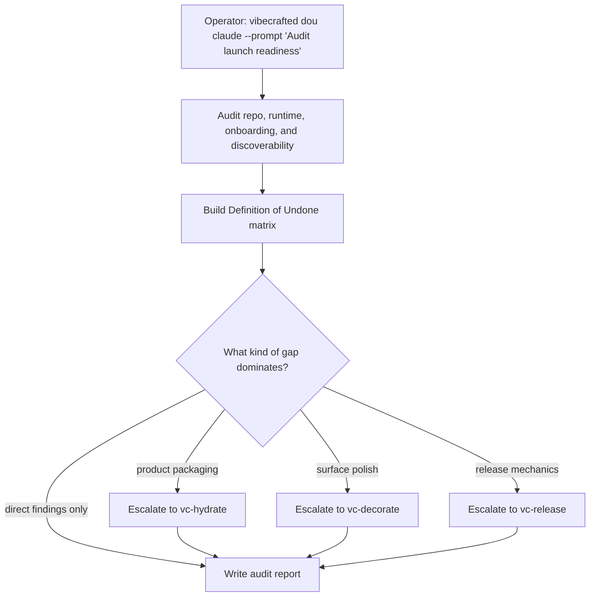

# Przepływ `vc-dou`

## Flow

## Trasy

| Wejście                   | Argumenty               | Produkuje                               | Wyjście            |
| ------------------------- | ----------------------- | --------------------------------------- | ------------------ |
| `vibecrafted dou <agent>` | `--prompt` lub `--file` | raport audytu DoU z transkryptem i meta | `0` przy dispatchu |
| `vc-dou <agent>`          | to samo                 | to samo                                 | `0` przy dispatchu |

### Krawędzie eskalacji

- Luki w pakowaniu, onboardingu lub SEO -> `vibecrafted hydrate <agent>`
- Niespójność interakcji lub wizualna -> `vibecrafted decorate <agent>`
- Findingi dotyczące deploymentu lub ryzyka launchu -> `vibecrafted release <agent>`

### Artefakty sesji

- Katalog artefaktów: `$VIBECRAFTED_HOME/artifacts/<org>/<repo>/<YYYY_MMDD>/`
- Lock: `$VIBECRAFTED_HOME/locks/<org>/<repo>/<run_id>.lock`
- Wyjścia: `reports/<timestamp>_<slug>_<agent>.md` z odpowiadającymi `.transcript.log` i `.meta.json`
