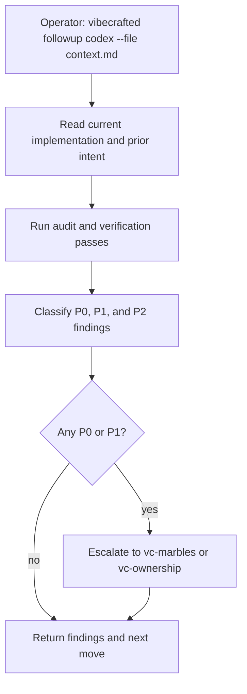

# Przepływ `vc-followup`

## Flow

## Trasy

| Wejście                        | Argumenty               | Produkuje                           | Wyjście            |
| ------------------------------ | ----------------------- | ----------------------------------- | ------------------ |
| `vibecrafted followup <agent>` | `--prompt` lub `--file` | raport findingów, transkrypt i meta | `0` przy dispatchu |
| `vc-followup <agent>`          | to samo                 | to samo                             | `0` przy dispatchu |

### Krawędzie eskalacji

- Pozostają problemy P0/P1 -> `vibecrafted marbles <agent>`
- Audyt pokazuje większą lukę w ownership w skali całego repo -> `vibecrafted ownership <agent>`
- Findingi wymagają wspólnej interpretacji przed działaniem -> `vibecrafted partner <agent>`

### Artefakty sesji

- Katalog artefaktów: `$VIBECRAFTED_HOME/artifacts/<org>/<repo>/<YYYY_MMDD>/`
- Lock: `$VIBECRAFTED_HOME/locks/<org>/<repo>/<run_id>.lock`
- Wyjścia: `reports/<timestamp>_<slug>_<agent>.md` z odpowiadającymi `.transcript.log` i `.meta.json`
