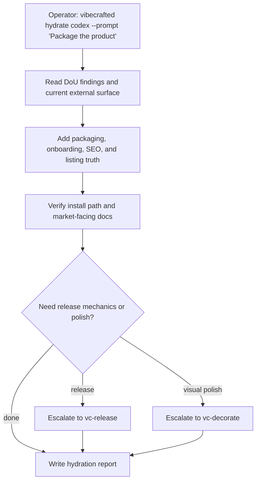

# Przepływ `vc-hydrate`

## Flow

## Trasy

| Wejście                       | Argumenty               | Produkuje                                                     | Wyjście            |
| ----------------------------- | ----------------------- | ------------------------------------------------------------- | ------------------ |
| `vibecrafted hydrate <agent>` | `--prompt` lub `--file` | zestaw docs/pakietu/raportu po hydrate plus transkrypt i meta | `0` przy dispatchu |
| `vc-hydrate <agent>`          | to samo                 | to samo                                                       | `0` przy dispatchu |

### Krawędzie eskalacji

- Finalna praca nad dowiezieniem na zewnątrz -> `vibecrafted release <agent>`
- Przebieg spójności wizualnej na powierzchni zewnętrznej -> `vibecrafted decorate <agent>`
- Potrzebny szerszy audyt luk w powierzchni produktu -> `vibecrafted dou <agent>`

### Artefakty sesji

- Katalog artefaktów: `$VIBECRAFTED_HOME/artifacts/<org>/<repo>/<YYYY_MMDD>/`
- Lock: `$VIBECRAFTED_HOME/locks/<org>/<repo>/<run_id>.lock`
- Wyjścia: `reports/<timestamp>_<slug>_<agent>.md` z odpowiadającymi `.transcript.log` i `.meta.json`
