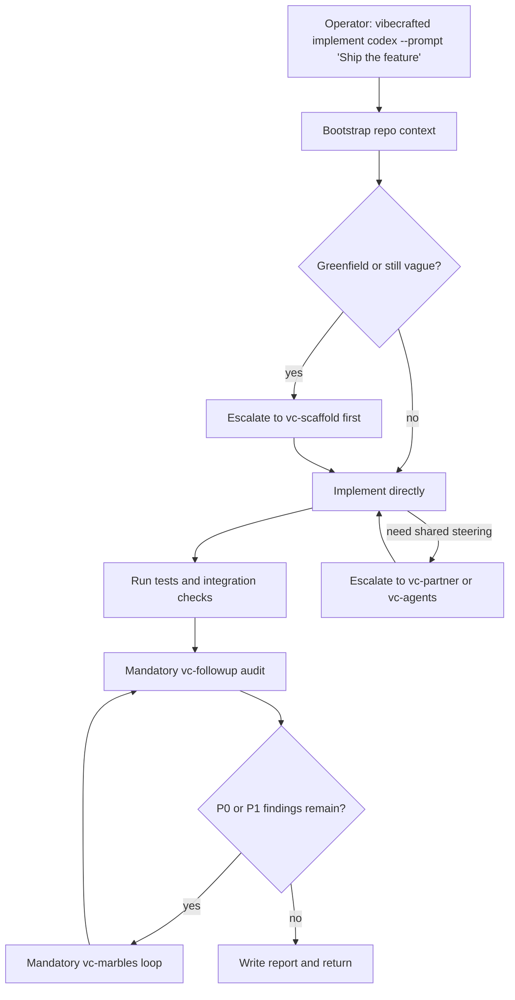

# Przepływ `vc-implement`

> Fasada: `vc-implement`. Alias: `vc-justdo`. Obie nazwy trafiają do tego
> samego dispatchera.

## Flow

## Trasy

| Wejście                         | Argumenty               | Produkuje                               | Wyjście            |
| ------------------------------- | ----------------------- | --------------------------------------- | ------------------ |
| `vibecrafted implement <agent>` | `--prompt` lub `--file` | raport implementacji, transkrypt i meta | `0` przy dispatchu |
| `vibecrafted justdo <agent>`    | alias `implement`       | to samo                                 | `0` przy dispatchu |
| `vc-implement <agent>`          | to samo                 | to samo                                 | `0` przy dispatchu |
| `vc-justdo <agent>`             | alias                   | to samo                                 | `0` przy dispatchu |

### Krawędzie eskalacji

- Scope jest wciąż architektoniczny -> `vibecrafted scaffold <agent>`
- Potrzebne wspólne sterowanie -> `vibecrafted partner <agent>`
- Pozostają problemy P0/P1 -> `vibecrafted marbles <agent>`

### Artefakty sesji

- Katalog artefaktów: `$VIBECRAFTED_HOME/artifacts/<org>/<repo>/<YYYY_MMDD>/`
- Lock: `$VIBECRAFTED_HOME/locks/<org>/<repo>/<run_id>.lock`
- Wyjścia: `reports/<timestamp>_<slug>_<agent>.md` z odpowiadającymi `.transcript.log` i `.meta.json`
- Wewnętrzny identyfikator skilla pozostaje `justdo` (prefiks run_id `just-`), żeby istniejące
  helpery, locki i ścieżki dispatchu działały dalej bez zmian.
