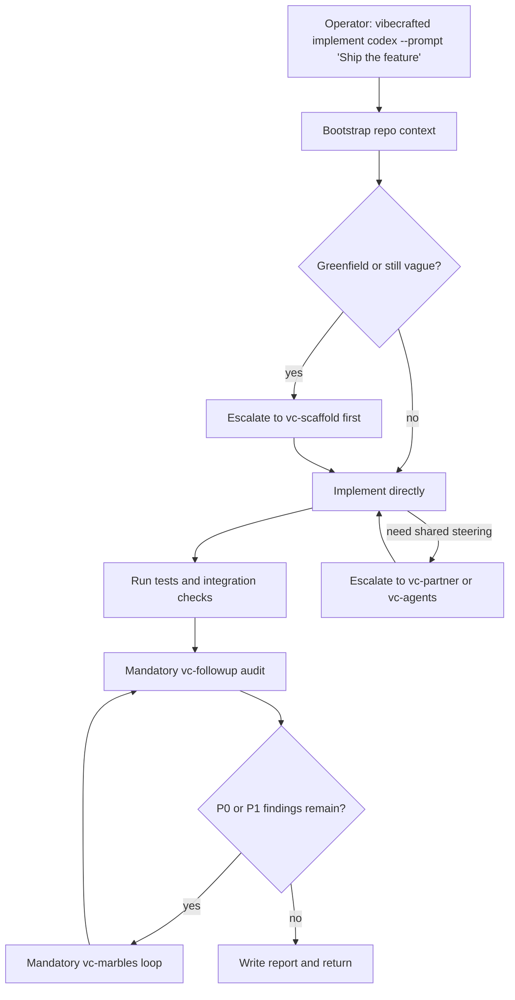

# Przepływ `vc-implement` — faza WRITE ship

> Skill id `implement`. Faza WRITE VC-ship. Nie alias `vc-justdo`.
> Prefiks run-id: `impl-` (osobny od `just-` justdo).

## Flow

## Trasy

| Wejście                         | Argumenty               | Produkuje                               | Wyjście            |
| ------------------------------- | ----------------------- | --------------------------------------- | ------------------ |
| `vibecrafted implement <agent>` | `--prompt` lub `--file` | raport implementacji, transkrypt i meta | `0` przy dispatchu |
| `vc-implement <agent>`          | to samo                 | to samo                                 | `0` przy dispatchu |

Nie trasy tego skilla: `vibecrafted justdo …` / `vc-justdo` (`vc-justdo`).

### Krawędzie eskalacji

- Scope jest wciąż architektoniczny → `vibecrafted scaffold <agent>`
- Potrzebne wspólne sterowanie → `vibecrafted partner <agent>`
- Pozostają problemy P0/P1 → `vibecrafted marbles <agent>`

### Tożsamość runtime

| Powierzchnia    | Wartość                           |
| --------------- | --------------------------------- |
| Skill id        | `implement`                       |
| Komórka matrycy | Cykl ship — faza WRITE            |
| Prefiks run-id  | `impl-`                           |
| Faza ship?      | Tak — w `SHIP_STAGES` po scaffold |
