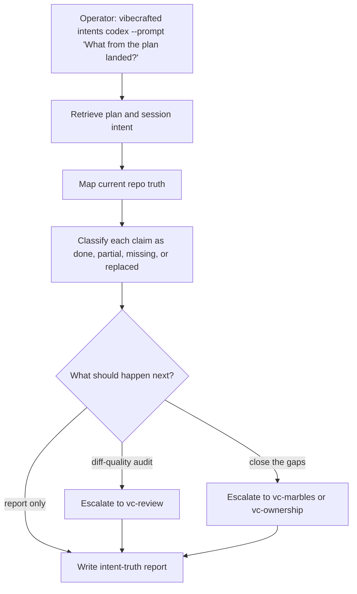

# Przepływ `vc-intents`

## Flow

## Trasy

| Wejście                       | Argumenty                     | Produkuje                                                        | Wyjście            |
| ----------------------------- | ----------------------------- | ---------------------------------------------------------------- | ------------------ |
| `vibecrafted intents <agent>` | `--prompt` lub `--file`       | raport audytu od intencji do prawdy runtime'u, transkrypt i meta | `0` przy dispatchu |
| `vc-intents <agent>`          | to samo, gdy wrapper istnieje | to samo                                                          | `0` przy dispatchu |

### Krawędzie eskalacji

- Bieżąca prawda wymaga code review, nie uzgadniania -> `vibecrafted review <agent>`
- Brakująca obiecana praca powinna zostać domknięta -> `vibecrafted marbles <agent>` lub `ownership`
- Pozostaje niejednoznaczność architektoniczna -> `vibecrafted partner <agent>`

### Artefakty sesji

- Katalog artefaktów: `$VIBECRAFTED_HOME/artifacts/<org>/<repo>/<YYYY_MMDD>/`
- Lock: `$VIBECRAFTED_HOME/locks/<org>/<repo>/<run_id>.lock`
- Wyjścia: `reports/<timestamp>_<slug>_<agent>.md` z odpowiadającymi `.transcript.log` i `.meta.json`
