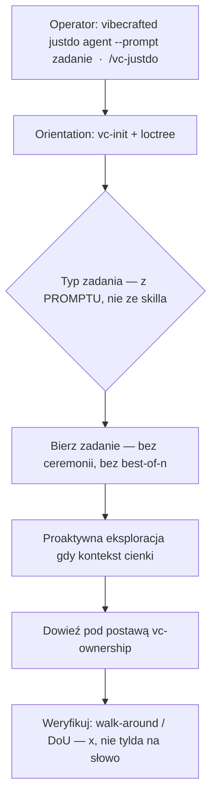

# Przepływ `vc-justdo` — samodzielna postawa

> Własne skill id `justdo`. Nie alias `vc-implement`. Non-pipeline
> (ADR-0001 Accepted). Typ zadania z promptu. Prefiks run-id: `just-`
> (osobny od `impl-` implementu).

## Flow

## Postawa (nie faza pipeline'u)

`vc-justdo` stoi **obok** cadence VC-ship. Faza WRITE to `vc-implement`.
Justdo = daily-rescue escape-hatch.

## Trasy

| Wejście                                     | Argumenty               | Produkuje                      | Wyjście            |
| ------------------------------------------- | ----------------------- | ------------------------------ | ------------------ |
| `vibecrafted justdo <agent>`                | `--prompt` lub `--file` | run runtime skill id `justdo`  | `0` przy dispatchu |
| `vc-justdo <agent>`                         | tak samo                | skrót shell → to samo skill id | `0` przy dispatchu |
| `$vc-justdo` / `/vc-justdo` (interaktywnie) | —                       | postawa Just Do w sesji        | —                  |

Nie trasy tego skilla: `vibecrafted implement …` (`vc-implement`).

### Tożsamość runtime

| Powierzchnia    | Wartość                             |
| --------------- | ----------------------------------- |
| Skill id        | `justdo`                            |
| Komórka matrycy | Dodatkowe launchery (nie cykl ship) |
| Prefiks run-id  | `just-`                             |
| Faza ship?      | Nie — poza `SHIP_STAGES`            |
