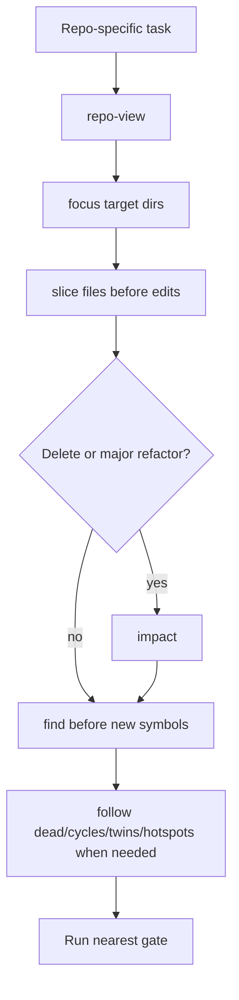

# `vc-loctree` Flow

## Flow

## Trasy

| Wejście          | Argumenty       | Produkuje               | Wyjście         |
| ---------------- | --------------- | ----------------------- | --------------- |
| `loct repo-view` | korzeń projektu | przegląd repo           | mapa            |
| `loct focus`     | katalog         | przegląd modułu         | mapa celu       |
| `loct slice`     | plik            | zależności i konsumenci | kontekst edycji |

## Reguła fallbacku

Grep lub surowe przeszukiwanie plików to evidence fallbacku tylko wtedy, gdy Loctree nie potrafi
odpowiedzieć na pytanie strukturalne. Odnotuj tę lukę strukturalną, aby powierzchnia Loctree mogła
się poprawić.
