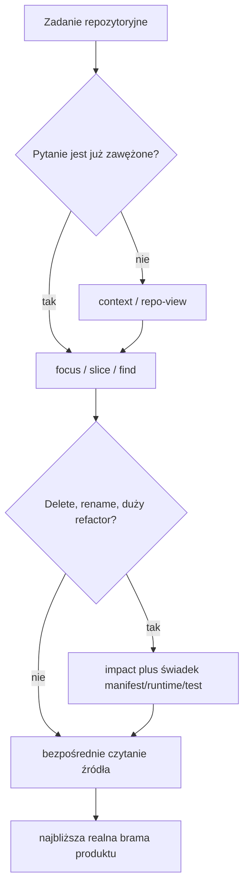

# Flow `vc-loctree`

Ścieżka literalna: `loct find Name` → `--where-symbol` → `loct body Name`.
Ścieżka discovery: `loct find --discover Terms` → literalna weryfikacja kandydatów.

Loctree mapuje reprezentowaną strukturę. Decyzje destrukcyjne wymagają osobnego
świadka dla entrypointów, manifestów, generated/dynamic wiring, testów i runtime.
