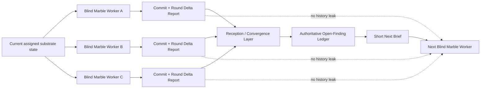

# vc-marbles — Protokół odbioru wyników / zbieżności

> Tylko operator / orchestrator.
> Nie ładuj tego dokumentu do kontekstu workera-agenta.

## Główna idea

Workerzy są ślepi z premedytacją.

Warstwa odbioru wyników (reception) to jedyne miejsce, któremu wolno pamiętać.

Warstwa odbioru posiada:

- autorytatywny rejestr otwartych findingów
- porównanie kandydatów między równoległymi rundami marbles
- matematykę delty / steppera
- akceptację zwycięskiej rundy
- emisję następnego krótkiego briefu bez wyciekania historii z powrotem do workera

## Kanoniczne obiekty

Niech:

- `L_prev` = autorytatywny rejestr otwartych findingów przed ewaluacją bieżącego kandydata
- `R_n` = raport jednej rundy marbles kandydata
- `A_n` = zaatakowane id z `R_n`
- `X_n` = rozwiązane id z `R_n`
- `S_n` = wciąż otwarte id z `R_n`
- `D_n` = odkryte otwarte id z `R_n`
- `G_n` = id regresji z `R_n`

Następny autorytatywny rejestr to:

```text
L_curr = (L_prev - X_n) ∪ S_n ∪ D_n ∪ G_n
```

Interpretacja:

- nierozwiązane stare problemy zostają otwarte, dopóki nie zostaną wprost rozwiązane
- ślepi workerzy nie muszą znać całego rejestru
- warstwa odbioru wykonuje merge

## Wagi severity

Używaj stabilnych wag numerycznych do porównania:

```text
high   = 3
medium = 2
low    = 1
```

Definicja:

`W(set) = sum(weight(item.severity) for each unique item in set)`

## Zbiory pochodne

Warstwa odbioru oblicza:

- `closed = L_prev ∩ X_n`
- `opened = (D_n ∪ G_n) - L_prev`
- `instant_fixes = X_n - L_prev`

Znaczenie:

- `closed` = wcześniej znane otwarte problemy, które ta runda faktycznie zamknęła
- `opened` = nowa otwarta kruchość wprowadzona lub odkryta w tej rundzie
- `instant_fixes` = problemy odkryte i naprawione wewnątrz tej samej rundy, zanim w ogóle weszły do rejestru

## Metryki

### Delta surowa

`delta_raw = |L_prev| - |L_curr|`

### Delta ważona

`delta_weighted = W(L_prev) - W(L_curr)`

To autorytatywna zmiana netto w globalnym otwartym chaosie.

### Współczynnik steppera

`stepper = (W(closed) + W(instant_fixes) - W(opened)) / max(W(A_n), 1)`

Interpretacja:

- `stepper > 0` → wybrany krok zredukował więcej kruchości, niż otworzył
- `stepper = 0` → krok był lokalnie neutralny
- `stepper < 0` → krok otworzył więcej chaosu, niż usunął

To lokalna metryka jakości cyklu.
Mierzy, czy wybrany krok był dobry, a nie tylko czy globalny backlog się ruszył.

### Tempo zbieżności

`convergence_rate = delta_weighted / max(W(L_prev), 1)`

To globalne tempo kurczenia się backlogu.

## Docisk bramki (gate clamp)

Jeśli `R_n.gate == fail`, dociśnij zarówno lokalny, jak i globalny optymizm:

```text
stepper = min(stepper, 0)
convergence_rate = min(convergence_rate, 0)
```

Padającej bramce nie wolno udawać zdrowej zbieżności.

## Baseline pierwszej rundy

Jeśli nie istnieje żaden zaakceptowany wcześniejszy raport:

- zaakceptuj pierwszy ważny raport jako bazowy merge
- ustaw `delta_raw = 0`
- ustaw `delta_weighted = 0`
- ustaw `stepper = 0`
- ustaw `convergence_rate = 0`

Runda 1 ustanawia rejestr.
Runda 2 rozpoczyna mierzalną zbieżność.

## Selekcja równoległych kandydatów

Jeśli wiele ślepych rund marbles odpala przeciw temu samemu baseline'owi, ewaluuj je niezależnie względem tego samego `L_prev`.

Wybierz zwycięzcę w tej kolejności:

1. gate pass bije gate fail
2. wyższa `delta_weighted`
3. wyższy `stepper`
4. niższa liczba regresji
5. mniejsza dotknięta powierzchnia (`files_touched`)
6. wyższe `tests_added`
7. decyzja operatora, jeśli wciąż remis

Odrzuceni kandydaci są wyłącznie archiwizowani.
Ich narracja nie może zasiać następnego workera.

## Akceptacja i aktualizacja rejestru

Dla zaakceptowanego kandydata:

```text
L_next = (L_prev - X_n) ∪ S_n ∪ D_n ∪ G_n
```

Utrwal:

- `L_next`
- ścieżkę zaakceptowanego raportu
- `delta_raw`
- `delta_weighted`
- `stepper`
- `convergence_rate`

Warstwa odbioru to jedyne miejsce, gdzie ten stan jest pamiętany.

## Konstrukcja następnego briefu

Następny worker może dostać wyłącznie:

- bieżącą przypisaną przez operatora ścieżkę podłoża
- ograniczenia operatora
- co najwyżej jedną krótką podpowiedź celu wyprowadzoną z dominującego pozostałego klastra

Przykłady ważnych krótkich podpowiedzi:

- `focus: release/operator-session`
- `focus: access/orders-create`
- `focus: errors/stripe-webhook`

Następny worker nie może dostać:

- tekstu poprzedniego raportu
- liczb delty
- liczb steppera
- rankingów kandydatów
- „co zrobił ostatni worker"
- narracyjnej historii pętli

Ślepota to feature, nie ograniczenie.

## Reguły decyzyjne

### STOP

Zatrzymaj pętlę, gdy:

- `L_next` jest pusty, lub
- w rejestrze pozostaje wyłącznie dług zaakceptowany przez operatora

### CONTINUE SAME SURFACE

Kontynuuj na tej samej powierzchni, gdy:

- `stepper > 0`, oraz
- klaster o najwyższej wadze pozostały do zrobienia to wciąż ten sam obszar

### SHIFT SURFACE

Przejdź na inną powierzchnię, gdy:

- `stepper <= 0` przez dwie zaakceptowane rundy, lub
- dominujący pozostały klaster się zmienia, lub
- bieżący klaster nie jest już najwyżej ważonym ryzykiem

### ESCALATE

Eskaluj do review operatora, gdy:

- bramka pada dwukrotnie na tym samym klastrze
- `delta_weighted < 0` dwa razy z rzędu
- równolegli kandydaci konfliktują strukturalnie
- przypisane podłoże lub sytuacja gałęzi zatrzymuje bezpieczną kontynuację
- zewnętrzna zależność lub decyzja produktowa blokuje postęp

## Notatka dla operatora

Worker nie ma być sprytny w kwestii pętli.

System staje się sprytny, bo warstwa odbioru:

- pamięta
- porównuje
- punktuje
- routuje

To tam żyje zbieżność.

## Architektura


