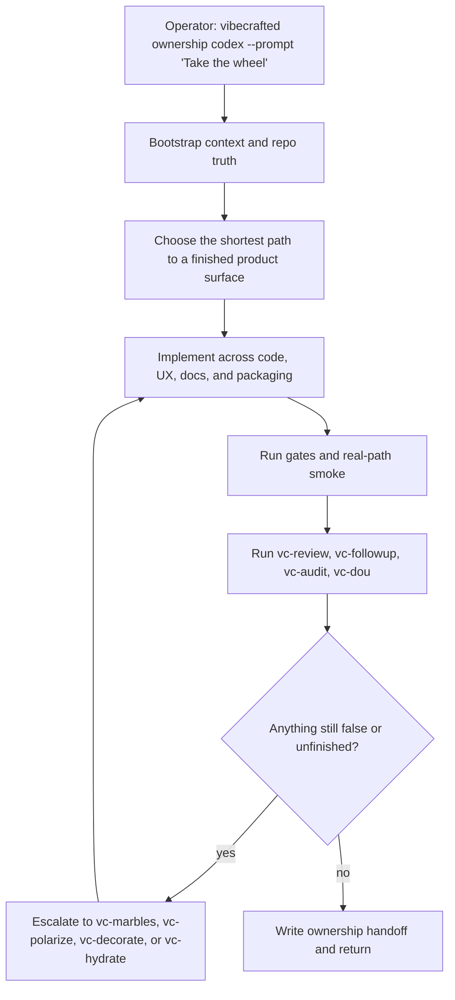

# `vc-ownership` Flow

## Flow

## Trasy

| Wejście                         | Argumenty                      | Produkuje                                        | Wyjście            |
| ------------------------------- | ------------------------------ | ------------------------------------------------ | ------------------ |
| `vibecrafted ownership <agent>` | `--prompt` lub `--file`        | raport dowiezienia end-to-end, transkrypt i meta | `0` przy dispatchu |
| `vc-ownership <agent>`          | tak samo, gdy istnieje wrapper | tak samo                                         | `0` przy dispatchu |

### Krawędzie eskalacji

- Potrzebne współsterowanie przy ryzykownej decyzji -> `vibecrafted partner <agent>`
- Potrzeba więcej jednostek wykonawczych -> `vc-agents`
- Pozostałe problemy P0/P1 po implementacji -> `vibecrafted marbles <agent>`
- Entropia po marbles -> `vibecrafted polarize <agent>`
- Luki w powierzchni produktu przed wykończeniem -> `vibecrafted dou <agent>`

### Artefakty sesji

- Korzeń artefaktów: `$VIBECRAFTED_HOME/artifacts/<org>/<repo>/<YYYY_MMDD>/`
- Lock: `$VIBECRAFTED_HOME/locks/<org>/<repo>/<run_id>.lock`
- Outputy: `reports/<timestamp>_<slug>_<agent>.md` z dopasowanym `.transcript.log` i `.meta.json`
