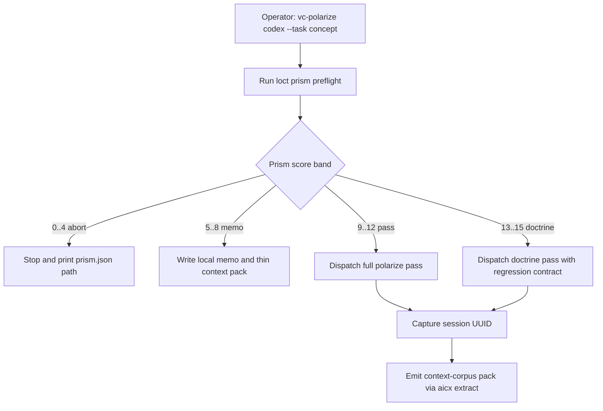

# `vc-polarize` Flow

> Front-face: `vc-polarize`. Runner bramkuje uruchomienia oparte na tasku
> przez Loctree prism score, zanim dojdzie do jakiegokolwiek dispatchu agenta.

## Flow

## Trasy

| Pasmo    | Wynik    | Działanie runnera                                     | Dispatch agenta |
| -------- | -------- | ----------------------------------------------------- | --------------- |
| abort    | `0..4`   | Pokaż operatorowi odrzucenie i ścieżkę prism          | nie             |
| memo     | `5..8`   | Wyemituj lokalne memo i cienki sidecar context-corpus | nie             |
| pass     | `9..12`  | Uruchom pełny prompt polarize z evidence prism        | tak             |
| doctrine | `13..15` | Uruchom przebieg doctrine z oczekiwaniem regression   | tak             |

### Context Corpus

- `pass` i `doctrine`: przechwyć `session: <uuid>` ze stdoutu agenta i opakuj
  `aicx extract --agent <agent> --session <uuid> --output <raw-path>`.
- `memo`: zapisz tylko cienki lokalny pack memo z `learning_use.allowed`
  ograniczonym do `format_examples`.
- `abort`: nie zapisuj wyjścia context-corpus.
- `--no-context-corpus`: pomiń opcjonalną emisję packu bez wywalania dispatchu.
