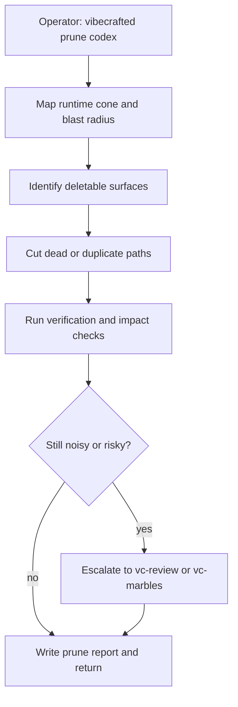

# `vc-prune` Flow

## Flow

## Trasy

| Wejście                     | Argumenty                          | Produkuje                                 | Wyjście            |
| --------------------------- | ---------------------------------- | ----------------------------------------- | ------------------ |
| `vibecrafted prune [agent]` | opcjonalne `--prompt` lub `--file` | raport discovery/prune, transcript i meta | `0` przy dispatchu |
| `vc-prune [agent]`          | to samo                            | to samo                                   | `0` przy dispatchu |

Gdy nie podano agenta, używany jest `claude`. Gdy nie podano `--prompt` ani
`--file`, `vc-prune` używa wbudowanego briefu repository health / prune
discovery: najpierw klasyfikuj, przygotuj findingi gotowe pod vc-scaffold i
commituj tylko usunięcia udowodnione jako bezpieczne — z zerem żywych
referencji i niskim zasięgiem zmiany.

### Krawędzie eskalacji

- Potrzebny audyt findings-first przed usuwaniem -> `vibecrafted review <agent>`
- Usunięcia ujawniają nowe kontrprzykłady -> `vibecrafted marbles <agent>`
- Potrzebne szersze sprzątanie powierzchni produktu -> `vibecrafted ownership <agent>`

### Artefakty sesji

- Root artefaktów: `$VIBECRAFTED_HOME/artifacts/<org>/<repo>/<YYYY_MMDD>/`
- Lock: `$VIBECRAFTED_HOME/locks/<org>/<repo>/<run_id>.lock`
- Wyjścia: `reports/<timestamp>_<slug>_<agent>.md` z pasującymi `.transcript.log` i `.meta.json`
