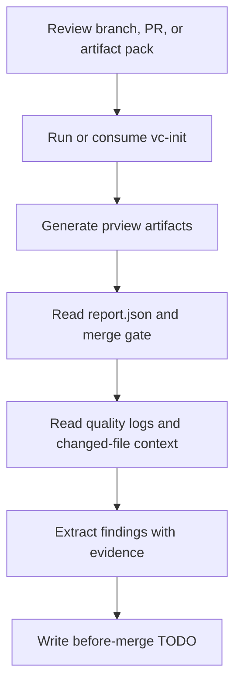

# `vc-prview` Flow

## Flow

## Trasy

| Wejście                           | Argumenty    | Produkuje         | Wyjście            |
| --------------------------------- | ------------ | ----------------- | ------------------ |
| `prview --pr <n>`                 | numer PR     | artifact pack     | evidence do review |
| `prview --with-tests --with-lint` | scope gałęzi | artefakty jakości | bramka merge       |
| `vc-prview <agent>`               | prompt/plik  | raport findingów  | ograniczony audyt  |

## Reguła wyjścia

Najpierw produkuj findingi, uporządkowane wg severity i ugruntowane w evidence
na poziomie pliku. Trzymaj podsumowania jako drugorzędne wobec wykonalnego
wyjścia przed mergem.
