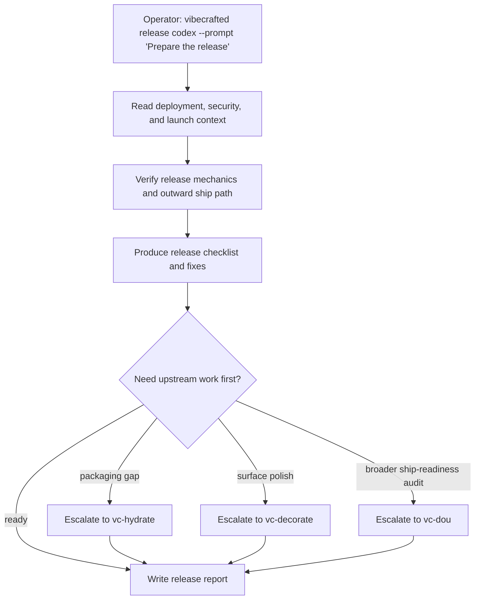

# `vc-release` Flow

## Flow

## Trasy

| Wejście                       | Argumenty               | Produkuje                           | Wyjście            |
| ----------------------------- | ----------------------- | ----------------------------------- | ------------------ |
| `vibecrafted release <agent>` | `--prompt` lub `--file` | raport release'u, transcript i meta | `0` przy dispatchu |
| `vc-release <agent>`          | to samo                 | to samo                             | `0` przy dispatchu |

### Krawędzie eskalacji

- Pakowanie lub onboarding wciąż niedokończone -> `vibecrafted hydrate <agent>`
- Wizualna powierzchnia release'u wymaga dopieszczenia -> `vibecrafted decorate <agent>`
- Produkt faktycznie nie jest jeszcze gotowy do dowiezienia -> `vibecrafted dou <agent>`

### Artefakty sesji

- Root artefaktów: `$VIBECRAFTED_HOME/artifacts/<org>/<repo>/<YYYY_MMDD>/`
- Lock: `$VIBECRAFTED_HOME/locks/<org>/<repo>/<run_id>.lock`
- Wyjścia: `reports/<timestamp>_<slug>_<agent>.md` z pasującymi `.transcript.log` i `.meta.json`
