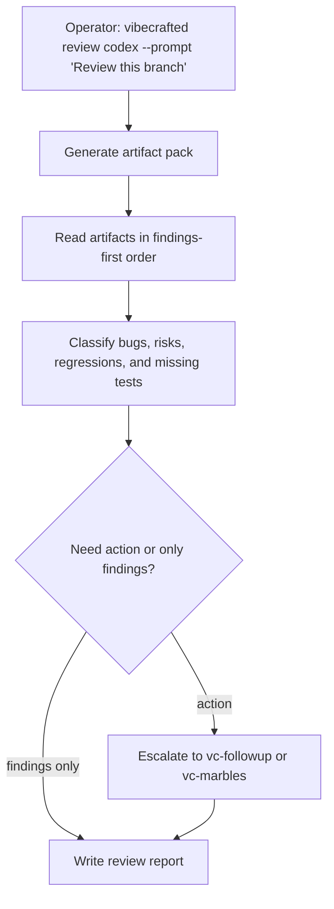

# `vc-review` Flow

## Flow

## Trasy

| Wejście                      | Argumenty               | Produkuje                        | Wyjście            |
| ---------------------------- | ----------------------- | -------------------------------- | ------------------ |
| `vibecrafted review <agent>` | `--prompt` lub `--file` | raport review, transcript i meta | `0` przy dispatchu |
| `vc-review <agent>`          | to samo                 | to samo                          | `0` przy dispatchu |

### Krawędzie eskalacji

- Findingi mają zostać zamienione w plan naprawy -> `vibecrafted followup <agent>`
- Findingi mają zostać domknięte w pętlach zbieżności -> `vibecrafted marbles <agent>`
- Review odsłania większą decyzję architektoniczną -> `vibecrafted partner <agent>`

### Artefakty sesji

- Root artefaktów: `$VIBECRAFTED_HOME/artifacts/<org>/<repo>/<YYYY_MMDD>/`
- Lock: `$VIBECRAFTED_HOME/locks/<org>/<repo>/<run_id>.lock`
- Wyjścia: `reports/<timestamp>_<slug>_<agent>.md` z pasującymi `.transcript.log` i `.meta.json`
