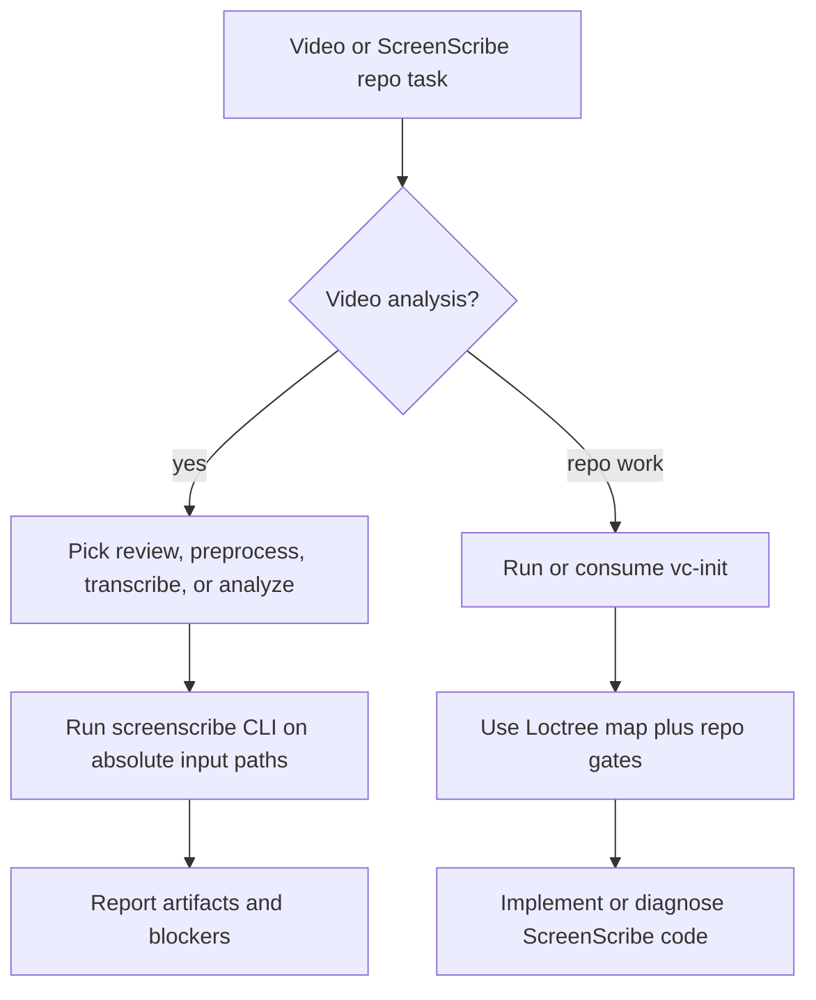

# `vc-screenscribe` Flow

## Flow

## Trasy

| Wejście                   | Argumenty         | Produkuje                               | Wyjście           |
| ------------------------- | ----------------- | --------------------------------------- | ----------------- |
| `screenscribe review`     | ścieżki wideo     | transcript, findingi, artefakty raportu | wyjście review    |
| `screenscribe preprocess` | ścieżka wideo     | bundle transcript-first                 | paczka artefaktów |
| `vc-screenscribe`         | prompt repo/debug | wskazówki świadome repo                 | raport            |

## Reguła weryfikacji

Zaobserwowane evidence z wideo musi stać się wykonalnymi findingami inżynierskimi. Poprawki
weryfikuje się przez właściwy runtime ScreenScribe lub bramkę raportu, a nie tylko przez
edytowanie dokumentów.
