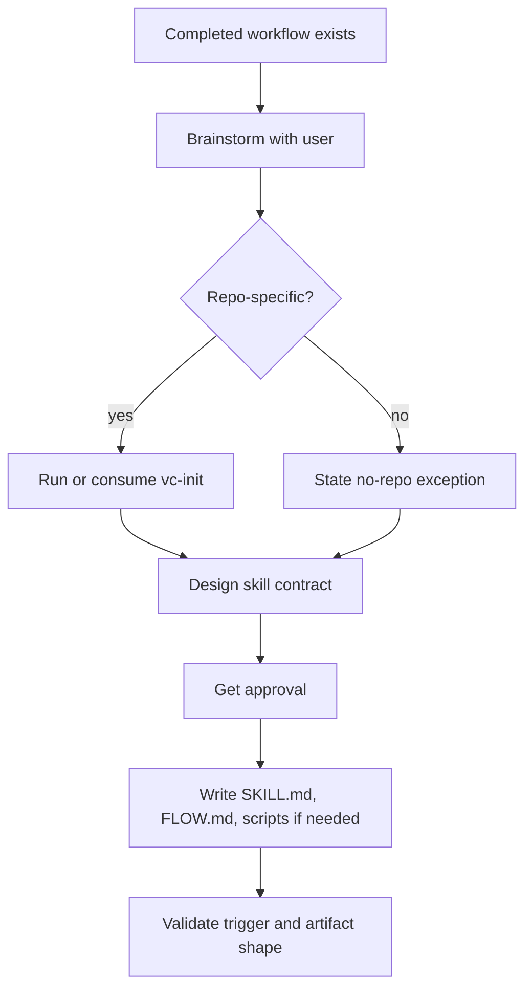

# `vc-skillaunch` Flow

## Flow

## Trasy

| Wejście         | Argumenty                     | Produkuje                          | Wyjście                    |
| --------------- | ----------------------------- | ---------------------------------- | -------------------------- |
| `vc-skillaunch` | kontekst ukończonego workflow | wielokrotnego użytku pakiet skilla | zainstalowany draft skilla |

## Reguła walidacji

Powstały skill musi dać się wywołać i wykonać bez ukrytego kontekstu z oryginalnej
rozmowy. Jeśli przyszły agent potrzebuje niewypowiedzianego założenia, skill nie jest gotowy.
