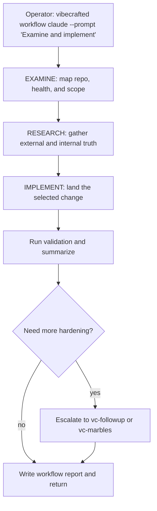

# `vc-workflow` Flow

## Flow

## Trasy

| Wejście                        | Argumenty               | Produkuje                          | Wyjście            |
| ------------------------------ | ----------------------- | ---------------------------------- | ------------------ |
| `vibecrafted workflow <agent>` | `--prompt` lub `--file` | raport workflow, transkrypt i meta | `0` przy dispatchu |
| `vc-workflow <agent>`          | jak wyżej               | jak wyżej                          | `0` przy dispatchu |

### Krawędzie eskalacji

- Potrzebne wspólne sterowanie przed implementacją -> `vibecrafted partner <agent>`
- Najlepszy kształt jest już oczywisty i należy go dowieźć bezpośrednio -> `vibecrafted implement <agent>` (ship WRITE); postawa Just Do -> `vibecrafted justdo <agent>`
- Walidacja znajduje pozostałe P0/P1 -> `vibecrafted marbles <agent>`

### Artefakty sesji

- Korzeń artefaktów: `$VIBECRAFTED_HOME/artifacts/<org>/<repo>/<YYYY_MMDD>/`
- Lock: `$VIBECRAFTED_HOME/locks/<org>/<repo>/<run_id>.lock`
- Wyjścia: finalny `reports/%Y-%m-%d_<org>_<repo>_<full_session_id>-<kind>.md`
  z pasującymi `.transcript.log` i `.meta.json`
