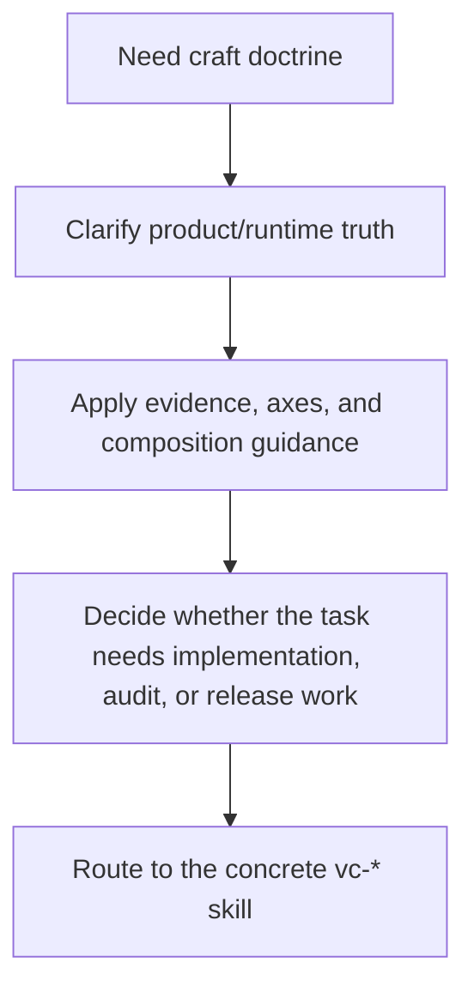

# `vibecraftsmanship` Flow

## Flow

## Trasy

| Wejście             | Argumenty                             | Produkuje                      | Wyjście                 |
| ------------------- | ------------------------------------- | ------------------------------ | ----------------------- |
| `vibecraftsmanship` | prompt koncepcyjny/o jakości produktu | wskazówki osadzone w doktrynie | wyznaczony kolejny ruch |

## Reguła zbieżności

Wybierz najmniejszą uczciwą ścieżkę do dowiezienia, a potem zbiegnij przez inspekcję,
kontrprzykłady i weryfikację. Raportuj kolejną prawdę zamiast deklarować przedwczesne
ukończenie.
